# Computer Networks — Layering, Switching & Data Link Layer

> **Complete exam-oriented notes** covering:
>
> * Concept of layering
> * OSI reference model
> * TCP/IP protocol stack
> * OSI vs TCP/IP
> * Packet switching
> * Circuit switching
> * Virtual circuit switching
> * Data Link Layer
> * Framing
> * Error detection
> * Medium Access Control
> * Ethernet
> * Ethernet bridging
> * Important tables, examples, comparisons, and Mermaid diagrams

---

# Table of Contents

1. [Concept of Layering](#1-concept-of-layering)
2. [Why Layering is Used](#2-why-layering-is-used)
3. [OSI Reference Model](#3-osi-reference-model)
4. [Functions of Each OSI Layer](#4-functions-of-each-osi-layer)
5. [OSI Encapsulation](#5-osi-encapsulation)
6. [TCP/IP Protocol Stack](#6-tcpip-protocol-stack)
7. [OSI vs TCP/IP](#7-osi-vs-tcpip)
8. [Packet Switching](#8-packet-switching)
9. [Circuit Switching](#9-circuit-switching)
10. [Virtual Circuit Switching](#10-virtual-circuit-switching)
11. [Circuit vs Packet vs Virtual Circuit](#11-circuit-vs-packet-vs-virtual-circuit)
12. [Data Link Layer](#12-data-link-layer)
13. [Framing](#13-framing)
14. [Frame Structure](#14-frame-structure)
15. [Framing Techniques](#15-framing-techniques)
16. [Error Detection](#16-error-detection)
17. [Parity Check](#17-parity-check)
18. [Two-Dimensional Parity](#18-two-dimensional-parity)
19. [Checksum](#19-checksum)
20. [CRC](#20-crc)
21. [Error Detection Comparison](#21-error-detection-comparison)
22. [Medium Access Control](#22-medium-access-control)
23. [Random Access Protocols](#23-random-access-protocols)
24. [ALOHA](#24-aloha)
25. [CSMA](#25-csma)
26. [CSMA/CD](#26-csmacd)
27. [CSMA/CA](#27-csmaca)
28. [MAC Address](#28-mac-address)
29. [Ethernet](#29-ethernet)
30. [Ethernet Frame](#30-ethernet-frame)
31. [Ethernet Bridging](#31-ethernet-bridging)
32. [Bridge Learning Process](#32-bridge-learning-process)
33. [Forwarding and Filtering](#33-forwarding-and-filtering)
34. [Broadcast and Collision Domains](#34-broadcast-and-collision-domains)
35. [Switch vs Hub vs Bridge](#35-switch-vs-hub-vs-bridge)
36. [Integrated Data Link Layer Flow](#36-integrated-data-link-layer-flow)
37. [Important Exam Definitions](#37-important-exam-definitions)
38. [Important Comparisons](#38-important-comparisons)
39. [One-Page Revision](#39-one-page-revision)
40. [Frequently Asked Exam Questions](#40-frequently-asked-exam-questions)

---

# 1. Concept of Layering

Computer networks are complex.

A single network communication process involves many different tasks:

```text
Application communication
        ↓
Reliable transport
        ↓
Routing
        ↓
Local network delivery
        ↓
Physical transmission
```

Trying to implement all of these functions as one giant protocol would make the system extremely difficult to design and maintain.

Therefore, networking is divided into **layers**.

---

# What is Layering?

**Layering** means dividing network communication into multiple levels, where each layer performs a specific set of functions.

Each layer:

* Provides services to the layer above it
* Uses services from the layer below it
* Communicates logically with its peer layer on another system

---

# Layering Diagram

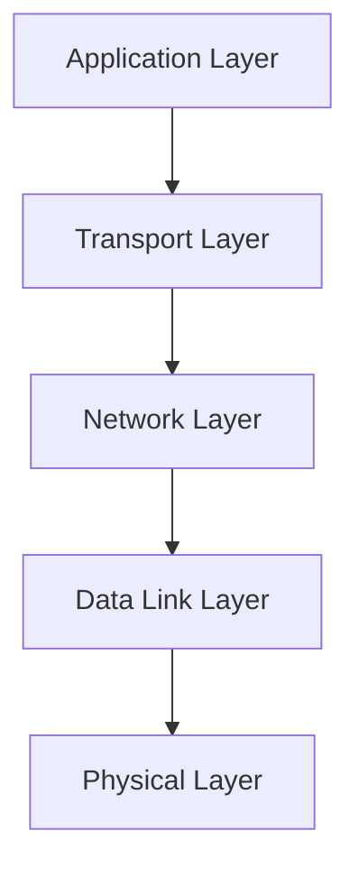

A more complete conceptual view:

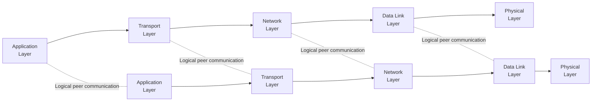

The layers do not literally communicate directly with the same layer on another machine.

Instead, data moves down the local stack, across the network, and then up the remote stack.

---

# 2. Why Layering is Used

## 2.1 Modularity

Each layer has a specific responsibility.

For example:

```text
Transport → reliability
Network → routing
Data Link → local delivery
Physical → signals
```

Changes in one layer can often be made without redesigning all other layers.

---

# 2.2 Easier Development

Developers can focus on one layer at a time.

For example:

* Ethernet engineers work on data-link technologies.
* IP engineers work on network-layer protocols.
* Application developers work with HTTP, DNS, etc.

---

# 2.3 Interoperability

Different vendors can implement protocols that follow common standards.

Example:

```text
Computer from Vendor A
        |
     Ethernet
        |
Switch from Vendor B
```

Both can communicate because they follow common protocol specifications.

---

# 2.4 Easier Troubleshooting

Layering allows problems to be isolated.

For example:

```text
Website not opening
        ↓
Can we resolve DNS?
        ↓
Can we reach the IP?
        ↓
Is TCP connection working?
        ↓
Is HTTP responding?
```

---

# 2.5 Abstraction

A layer hides unnecessary implementation details from the layer above it.

Example:

An application does not need to know:

> "Which electrical signal was used to represent this bit?"

It simply uses the network service.

---

# 2.6 Encapsulation

Each layer adds its own control information.

For example:

```text
Application Data
      ↓
TCP Header + Data
      ↓
IP Header + TCP Segment
      ↓
Ethernet Header + IP Packet + Trailer
```

This process is called:

> **Encapsulation**

---

# 3. OSI Reference Model

OSI stands for:

> **Open Systems Interconnection**

The OSI reference model contains **7 layers**.

From top to bottom:

```text
7. Application
6. Presentation
5. Session
4. Transport
3. Network
2. Data Link
1. Physical
```

---

# OSI 7-Layer Model

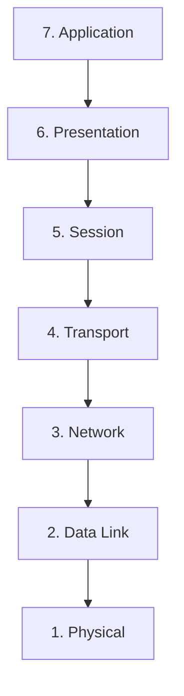

---

# OSI Layer Table

| Layer | Name         | Main Responsibility                             |
| ----: | ------------ | ----------------------------------------------- |
|     7 | Application  | Network services to applications                |
|     6 | Presentation | Data representation, transformation, encryption |
|     5 | Session      | Session establishment and management            |
|     4 | Transport    | End-to-end/process communication                |
|     3 | Network      | Logical addressing and routing                  |
|     2 | Data Link    | Framing, MAC, error detection, local delivery   |
|     1 | Physical     | Transmission of raw bits/signals                |

---

# 4. Functions of Each OSI Layer

# Layer 7 — Application

Provides network-related services to applications.

Examples:

```text
HTTP
DNS
SMTP
FTP
```

Examples of application-level operations:

```text
GET web page
Resolve domain name
Send email
Transfer file
```

---

# Layer 6 — Presentation

Responsible for representing data in a form that applications can understand.

Potential functions include:

* Data translation
* Encoding
* Compression
* Encryption/decryption

Example:

```text
Application Data
      ↓
Encoding
      ↓
Compressed / transformed representation
```

> In practical modern Internet systems, these functions are often implemented by libraries or protocols across multiple layers rather than by a distinct "Presentation Layer" protocol.

---

# Layer 5 — Session

Responsible conceptually for managing sessions between applications.

Functions can include:

* Establishing sessions
* Maintaining sessions
* Synchronizing communication
* Terminating sessions

Again, in modern Internet protocol stacks, explicit OSI Session-layer protocols are not always separately visible.

---

# Layer 4 — Transport

Provides process-to-process communication.

Examples:

```text
TCP
UDP
```

Functions include:

* Segmentation
* Reassembly
* Reliability
* Flow control
* Congestion control
* Multiplexing through ports

---

# Layer 3 — Network

Responsible for delivery across multiple networks.

Functions:

* Logical addressing
* Routing
* Packet forwarding

Example:

```text
IPv4
IPv6
```

---

# Layer 2 — Data Link

Responsible for communication over a local link/network segment.

Functions include:

* Framing
* MAC addressing
* Error detection
* Medium access control
* Local delivery

Examples:

```text
Ethernet
Wi-Fi MAC
```

---

# Layer 1 — Physical

Responsible for transmission of raw bits through a physical medium.

Examples:

```text
Copper cable
Fiber optic
Radio
Electrical signals
Light pulses
```

---

# 5. OSI Encapsulation

Suppose an application wants to send:

```text
Hello
```

At the application layer:

```text
Data = Hello
```

Transport layer adds its header:

```text
TCP Header + Hello
```

Network layer adds an IP header:

```text
IP Header + TCP Header + Hello
```

Data-link layer adds a frame header and trailer:

```text
Ethernet Header
+
IP Header
+
TCP Header
+
Hello
+
Ethernet Trailer
```

Physical layer transmits bits/signals.

---

# Encapsulation Diagram

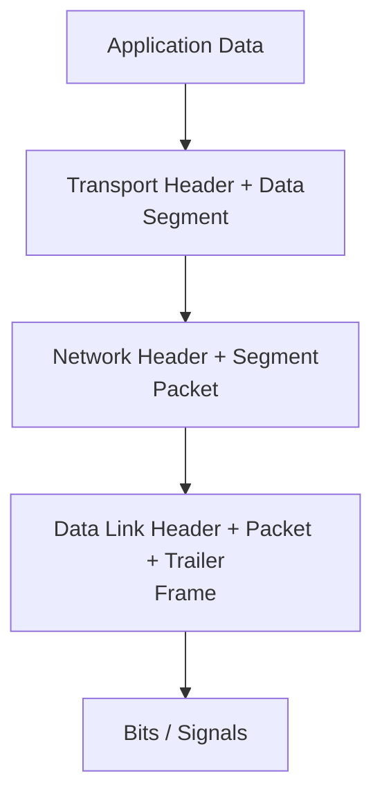

---

# Decapsulation

At the destination, the reverse process occurs.

```text
Bits
 ↓
Frame
 ↓
Packet
 ↓
Segment
 ↓
Application Data
```

This is called:

> **Decapsulation**

---

# Protocol Data Units

| Layer       | PDU                            |
| ----------- | ------------------------------ |
| Application | Data / Message                 |
| Transport   | Segment (TCP) / Datagram (UDP) |
| Network     | Packet / IP Datagram           |
| Data Link   | Frame                          |
| Physical    | Bits                           |

---

# 6. TCP/IP Protocol Stack

The Internet does not normally implement the complete seven-layer OSI model as seven distinct protocol layers.

The TCP/IP architecture is commonly described using **4 layers**.

```text
Application
Transport
Internet
Network Access / Link
```

A common mapping is:

| TCP/IP Layer          | Common Protocols     |
| --------------------- | -------------------- |
| Application           | HTTP, DNS, SMTP, FTP |
| Transport             | TCP, UDP             |
| Internet              | IP, ICMP             |
| Link / Network Access | Ethernet, Wi-Fi, ARP |

---

# TCP/IP Stack Diagram

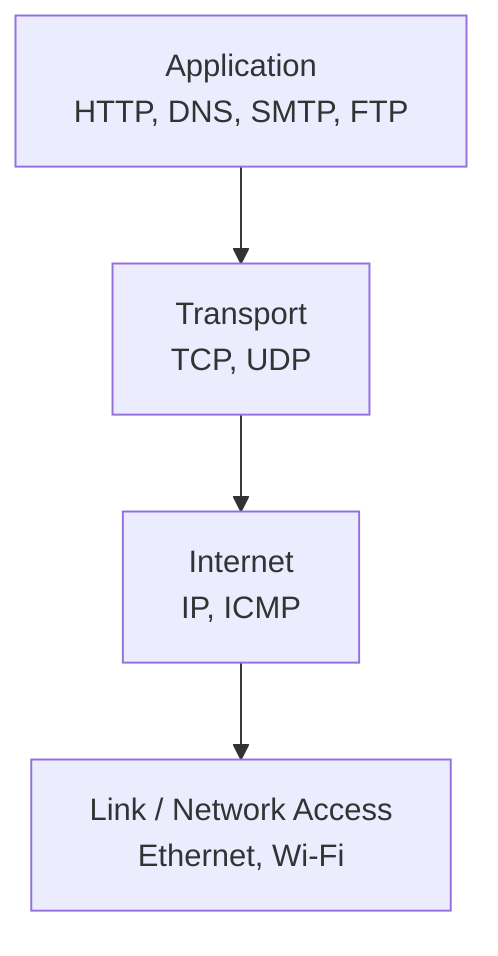

---

# Mapping OSI to TCP/IP

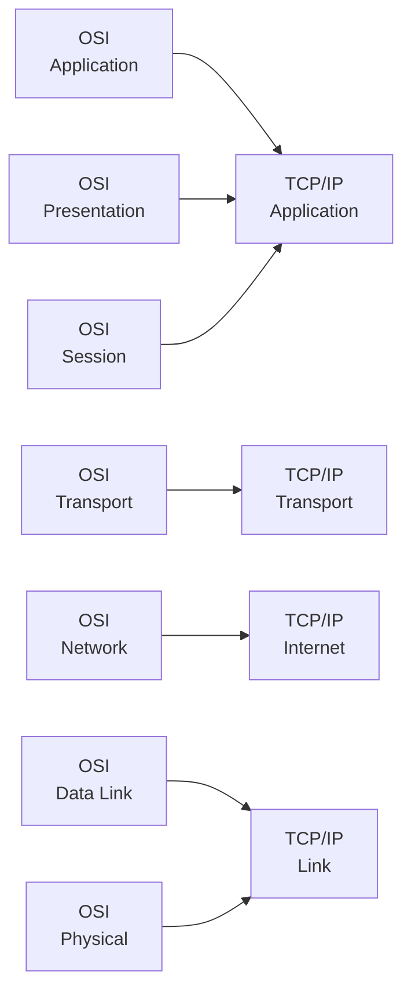

---

# 7. OSI vs TCP/IP

| Feature               | OSI                          | TCP/IP                                    |
| --------------------- | ---------------------------- | ----------------------------------------- |
| Full name             | Open Systems Interconnection | Internet protocol suite                   |
| Layers                | 7                            | Commonly 4                                |
| Origin                | ISO                          | DoD/ARPANET-derived Internet architecture |
| Application structure | 3 layers                     | 1 combined layer                          |
| Transport             | Yes                          | Yes                                       |
| Network/Internet      | Network                      | Internet                                  |
| Data Link + Physical  | Separate                     | Commonly combined as Link                 |
| Main role             | Reference model              | Practical Internet protocol architecture  |

---

# Important Difference

OSI:

```text
Application
Presentation
Session
Transport
Network
Data Link
Physical
```

TCP/IP:

```text
Application
Transport
Internet
Link
```

The three OSI upper layers:

```text
Application
Presentation
Session
```

are generally combined into TCP/IP's:

```text
Application
```

The OSI:

```text
Data Link
Physical
```

are commonly combined conceptually into:

```text
Link
```

in the four-layer TCP/IP model.

---

# 8. Packet Switching

Packet switching divides a message into smaller units called:

> **Packets**

Each packet is transmitted through the network.

---

# Basic Idea

Suppose a large message is:

```text
MESSAGE
```

It is divided into:

```text
Packet 1
Packet 2
Packet 3
Packet 4
```

The packets can travel through network resources as needed.

---

# Packet Switching Diagram

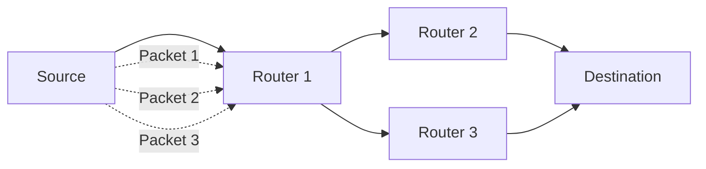

---

# Store-and-Forward

A packet-switching router typically:

1. Receives the packet.
2. Stores enough of it to process/forward it.
3. Determines the next hop.
4. Forwards the packet.

This is commonly called:

> **Store-and-forward**

---

# Advantages of Packet Switching

* Efficient use of shared network resources
* Good for bursty data traffic
* Multiple users can share links
* No dedicated path is required in traditional datagram packet switching

---

# Disadvantages

* Variable delay
* Possible packet loss
* Packets may be queued
* Packets may take different paths
* Network congestion can occur

---

# Datagram Packet Switching

In datagram packet switching:

> Every packet is treated independently.

Each packet contains enough information for the network to forward it toward the destination.

Example:

```text
Packet 1 → Path A
Packet 2 → Path B
Packet 3 → Path A
```

Packets can potentially arrive:

* Out of order
* With different delays
* With some packets missing

Higher layers may handle ordering/reliability.

---

# 9. Circuit Switching

In circuit switching, a dedicated communication path is established before data transfer.

The resources along the path are reserved for the communication session.

---

# Basic Process

```text
1. Establish circuit
2. Transfer data
3. Release circuit
```

---

# Circuit Switching Diagram

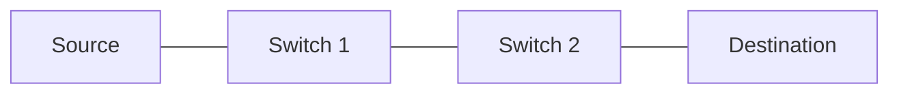

The path is established:

```text
Source
  ↓
Switch 1
  ↓
Switch 2
  ↓
Destination
```

The circuit remains associated with the communication until it is released.

---

# Example

Traditional telephone networks historically used circuit switching.

When a call is established:

```text
Caller
 ↓
Switch
 ↓
Switch
 ↓
Receiver
```

Network resources are committed to the circuit.

---

# Phases of Circuit Switching

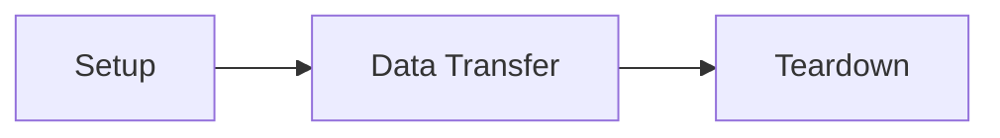

---

# Advantages

* Predictable resource allocation
* Stable path
* Consistent service characteristics once established
* Good for continuous traffic

---

# Disadvantages

* Setup delay
* Reserved resources may remain unused during silence
* Less efficient for bursty computer traffic
* A circuit must be established before transmission

---

# 10. Virtual Circuit Switching

Virtual circuit switching combines concepts of packet switching and connection-oriented communication.

A logical path is established before packets are sent.

Unlike a dedicated physical circuit, the physical network resources need not be permanently reserved exclusively for one connection.

---

# Basic Idea

```text
Setup logical path
       ↓
Transmit packets
       ↓
Packets follow the established virtual path
       ↓
Release virtual circuit
```

---

# Virtual Circuit Diagram

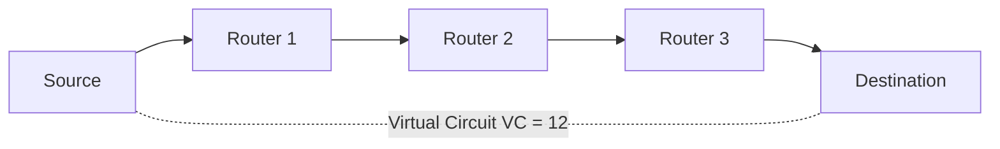

Routers can maintain state such as:

```text
Incoming interface
Incoming VC identifier
        ↓
Outgoing interface
Outgoing VC identifier
```

---

# Example

A packet may have:

```text
VC Identifier = 12
```

Router 1 might translate:

```text
VC 12
 ↓
VC 37
```

At the next router:

```text
VC 37
 ↓
VC 51
```

Therefore, the packet follows a logical connection even though the identifier can change from link to link.

---

# Characteristics

| Feature                         | Virtual Circuit               |
| ------------------------------- | ----------------------------- |
| Setup required                  | Usually yes                   |
| Logical path                    | Yes                           |
| Dedicated physical circuit      | No                            |
| Packets follow established path | Yes                           |
| Per-connection state            | Yes                           |
| Packet order                    | Usually easier to preserve    |
| Example technologies            | Frame Relay, ATM historically |

---

# 11. Circuit vs Packet vs Virtual Circuit

| Feature                 | Circuit Switching             | Datagram Packet Switching        | Virtual Circuit                           |
| ----------------------- | ----------------------------- | -------------------------------- | ----------------------------------------- |
| Setup                   | Yes                           | No                               | Yes                                       |
| Dedicated resources     | Traditionally yes             | No                               | Usually no                                |
| Logical path            | Yes                           | Not required                     | Yes                                       |
| Packets independent     | No                            | Yes                              | No                                        |
| Router connection state | Circuit state                 | Generally no per-flow path state | Yes                                       |
| Delay                   | More predictable after setup  | Variable                         | More predictable than datagram forwarding |
| Resource efficiency     | Lower for bursty traffic      | High                             | High                                      |
| Ordering                | Natural                       | Not guaranteed                   | Usually maintained by path                |
| Example                 | Traditional telephone network | IP Internet                      | ATM / Frame Relay                         |

---

# 12. Data Link Layer

The Data Link Layer is:

> **Layer 2 of the OSI model**

It provides communication across a single network link or local network.

---

# Major Functions

The Data Link Layer commonly handles:

1. Framing
2. Physical/MAC addressing
3. Error detection
4. Medium Access Control
5. Link-level flow/error handling in some technologies
6. Local delivery

---

# Data Link Layer Position

```text
Application
     ↓
Transport
     ↓
Network
     ↓
Data Link ← Current topic
     ↓
Physical
```

---

# 13. Framing

A physical link transmits a continuous sequence of bits.

The receiver needs to determine:

> "Where does one data unit end and the next one begin?"

The Data Link Layer solves this using:

> **Framing**

---

# What is a Frame?

A frame is a data-link-layer unit containing:

```text
Header
+
Payload
+
Trailer
```

Conceptually:

```text
+---------+----------------+---------+
| Header  |    Payload     | Trailer |
+---------+----------------+---------+
```

---

# Why Framing?

Framing helps the receiver identify:

* Start of a frame
* End of a frame
* Addressing information
* Error-detection information
* Control information

---

# 14. Frame Structure

A generic frame can be visualized as:

```text
+----------------+------------------+----------------+
| Header         | Data / Payload   | Trailer        |
+----------------+------------------+----------------+
```

The exact fields depend on the data-link protocol.

---

# Ethernet Frame Example

```text
+----------+-----------+--------+------+---------+----------+
| Preamble | Dest MAC  | Src MAC| Type | Payload | FCS      |
+----------+-----------+--------+------+---------+----------+
```

Ethernet also has additional fields and details such as SFD, and VLAN-tagged frames may include a tag.

---

# 15. Framing Techniques

Common framing techniques include:

1. Character/byte count
2. Byte stuffing
3. Bit stuffing
4. Special delimiters

---

# 15.1 Character Count

The frame header contains the number of bytes in the frame.

Example:

```text
Length = 6
```

Then the receiver knows that:

```text
6 bytes
```

belong to the frame.

---

## Problem

If the length field becomes corrupted:

```text
Expected length = 6
Corrupted length = 20
```

the receiver may lose synchronization.

---

# 15.2 Byte Stuffing

A special byte is used as a frame delimiter.

Suppose:

```text
FLAG = special byte
```

If the same byte occurs inside the payload, an escape byte is inserted.

Example:

```text
Original payload:

A FLAG B
```

After byte stuffing:

```text
A ESC FLAG B
```

The receiver removes the escape byte.

---

# Byte Stuffing Diagram

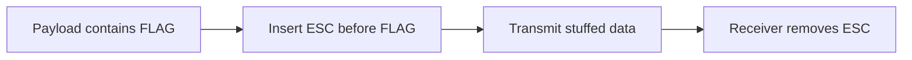

---

# 15.3 Bit Stuffing

Bit stuffing is commonly associated with bit-oriented framing.

A typical rule is:

> After a sequence of five consecutive `1` bits in the payload, insert a `0`.

Example:

```text
Original:

01111110
```

This contains six consecutive `1`s.

Stuffing:

```text
011111010
```

The exact framing rules depend on the protocol.

---

# Bit Stuffing Example

Suppose payload contains:

```text
111110
```

After five `1`s:

```text
11111 0
```

Insert a `0`:

```text
1111100
```

The receiver removes the stuffed bit.

---

# Why Bit Stuffing?

It prevents payload data from accidentally looking like a reserved frame delimiter.

---

# 16. Error Detection

Data can be corrupted during transmission.

Possible causes:

* Electrical noise
* Radio interference
* Hardware problems
* Signal attenuation
* Crosstalk

Example:

```text
Sender:
10110110

Channel corruption

Receiver:
10100110
```

One or more bits changed.

---

# Error Detection vs Error Correction

## Error Detection

The receiver determines:

> "Something is wrong."

It does not necessarily determine the correct data.

Examples:

```text
Parity
Checksum
CRC
```

---

## Error Correction

The receiver determines:

> "Something is wrong, and I can reconstruct the original data."

Examples include coding techniques such as:

```text
Hamming codes
Forward Error Correction
```

---

# 17. Parity Check

Parity is one of the simplest error-detection methods.

There are two common forms:

```text
Even parity
Odd parity
```

---

# Even Parity

The parity bit is selected so the total number of `1`s becomes even.

Example:

```text
Data:
1011001
```

Number of ones:

```text
4
```

Already even.

Parity bit:

```text
0
```

Therefore:

```text
10110010
```

---

# Odd Parity

The parity bit makes the total number of `1`s odd.

For:

```text
1011001
```

there are 4 ones.

Therefore parity bit:

```text
1
```

Result:

```text
10110011
```

---

# Limitation of Simple Parity

Parity can detect:

```text
Single-bit error
```

but it may fail to detect some errors involving an even number of flipped bits.

Example:

```text
Original:
10110010

Two bits changed:
10010000
```

The parity may remain unchanged.

---

# 18. Two-Dimensional Parity

Instead of adding one parity bit to the entire data, data can be arranged in rows and columns.

Example:

```text
1 0 1 1
0 1 0 1
1 1 1 0
```

Parity can be calculated for:

* Each row
* Each column

This provides stronger error detection than a single parity bit.

---

# Example

```text
       C1 C2 C3 C4
       ↓  ↓  ↓  ↓
R1     1  0  1  1
R2     0  1  0  1
R3     1  1  1  0
```

Suppose one bit flips.

The corresponding:

```text
row parity
+
column parity
```

will indicate the error location.

---

# 19. Checksum

A checksum works by performing arithmetic over the transmitted data and including the result in the message.

The receiver performs a similar calculation to check whether the result agrees.

Checksum is commonly associated with:

* Network protocols
* IP/TCP/UDP checksum mechanisms

---

# Simplified Checksum Example

Suppose data contains:

```text
1001
0011
0101
```

The sender performs a defined binary addition and generates a checksum.

The receiver repeats the calculation.

If the verification result does not match:

```text
Error detected
```

---

# Checksum Characteristics

| Feature             | Checksum                                  |
| ------------------- | ----------------------------------------- |
| Complexity          | Moderate                                  |
| Detection strength  | Better than simple parity for many errors |
| Common use          | Networking protocols                      |
| Hardware complexity | Moderate                                  |
| Example             | Internet checksums                        |

---

# 20. CRC

CRC stands for:

> **Cyclic Redundancy Check**

CRC is one of the most important error-detection techniques used in computer networks.

Ethernet uses an FCS based on CRC.

---

# Basic CRC Idea

The sender treats the data as a binary polynomial and divides it by a predefined generator polynomial.

The remainder becomes the CRC.

Conceptually:

```text
Data + CRC
        ↓
Transmission
        ↓
Receiver divides by same generator
        ↓
Remainder checked
```

---

# CRC Diagram

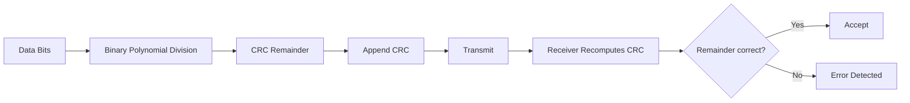

---

# CRC Example Concept

Suppose:

```text
Data = 1101011011
```

Generator:

```text
1011
```

The sender performs modulo-2 division.

The remainder is appended to the data.

The receiver divides the received bit sequence by the same generator.

If:

```text
Remainder = 0
```

the frame passes the CRC check under the simplified assumption.

Otherwise:

```text
Error detected
```

---

# Why CRC is Powerful

CRC is good at detecting:

* Single-bit errors
* Many multi-bit errors
* Burst errors

Its exact detection guarantees depend on the generator polynomial.

---

# 21. Error Detection Comparison

| Technique              | Complexity | Detection Capability                |
| ---------------------- | ---------- | ----------------------------------- |
| Single Parity          | Very low   | Limited                             |
| Two-Dimensional Parity | Low        | Better                              |
| Checksum               | Moderate   | Good                                |
| CRC                    | Higher     | Very strong for many error patterns |

For exam purposes:

```text
Parity < Checksum < CRC
```

is a useful rough intuition for detection strength, though exact guarantees depend on implementation.

---

# 22. Medium Access Control

MAC stands for:

> **Medium Access Control**

It is a sublayer of the Data Link Layer.

Its job is to determine:

> "Who gets to use the shared communication medium, and when?"

---

# Why MAC is Necessary

Suppose multiple devices share one medium.

```text
        Shared Medium
       /      |      \
      A       B       C
```

If A, B, and C transmit simultaneously:

```text
A ────┐
B ────┼──> Collision
C ────┘
```

Therefore, some mechanism is needed to coordinate access.

---

# MAC Sublayer

The IEEE 802 architecture conceptually divides the Data Link Layer into:

```text
Logical Link Control (LLC)
        +
Medium Access Control (MAC)
```

The exact practical organization depends on the technology.

---

# MAC Protocol Categories

MAC protocols can be broadly grouped into:

### Channel Partitioning

Divide the medium.

Examples:

```text
TDMA
FDMA
CDMA
```

### Random Access

Devices compete for the medium.

Examples:

```text
ALOHA
CSMA
CSMA/CD
CSMA/CA
```

### Controlled Access

Access is managed more explicitly.

Examples include:

```text
Polling
Token passing
```

---

# 23. Random Access Protocols

In random-access protocols:

> Stations contend for access to the medium.

---

# 24. ALOHA

ALOHA is one of the earliest random-access protocols.

The basic idea is:

> Transmit when you have data.

If a collision occurs:

```text
Wait a random amount of time
        ↓
Retransmit
```

---

# Pure ALOHA

A station transmits immediately when it has data.

If another station transmits at an overlapping time:

```text
Collision
```

---

# Slotted ALOHA

Time is divided into slots.

A station may begin transmission only at the start of a slot.

This reduces the collision window.

---

# Pure ALOHA vs Slotted ALOHA

| Feature                  | Pure ALOHA | Slotted ALOHA |
| ------------------------ | ---------- | ------------- |
| Time slots               | No         | Yes           |
| Transmission start       | Anytime    | Slot boundary |
| Collision probability    | Higher     | Lower         |
| Maximum ideal throughput | ~18.4%     | ~36.8%        |

---

# 25. CSMA

CSMA stands for:

> **Carrier Sense Multiple Access**

Before transmitting, a station listens to the medium.

Conceptually:

```text
Listen
  ↓
Is channel free?
  ↓
Yes → Transmit
No → Wait
```

---

# CSMA Diagram

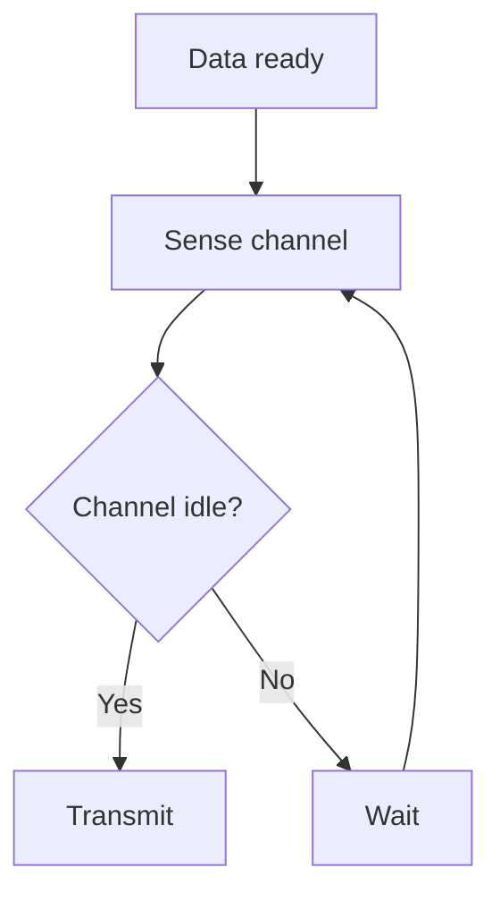

---

# Why Collisions Can Still Happen

Even though a device senses the channel, two devices might sense it as idle at nearly the same time.

Example:

```text
A senses idle
B senses idle

A starts transmitting
B starts transmitting

       ↓

Collision
```

This happens because propagation delay exists.

---

# CSMA Variants

Common persistence strategies:

### 1-Persistent CSMA

If channel is idle:

```text
Transmit immediately.
```

If busy:

```text
Keep sensing until idle.
```

---

### Nonpersistent CSMA

If busy:

```text
Wait a random amount of time
then sense again.
```

---

### p-Persistent CSMA

Used with slotted channels.

When channel is idle:

```text
Transmit with probability p
Defer with probability 1-p
```

---

# 26. CSMA/CD

CSMA/CD stands for:

> **Carrier Sense Multiple Access with Collision Detection**

It was traditionally used in shared, half-duplex Ethernet.

---

# Process

```text
1. Sense channel
2. If idle, transmit
3. Monitor for collision
4. If collision occurs:
   - Stop transmission
   - Send collision indication/jam signal
   - Wait using backoff
   - Retransmit
```

---

# CSMA/CD Diagram

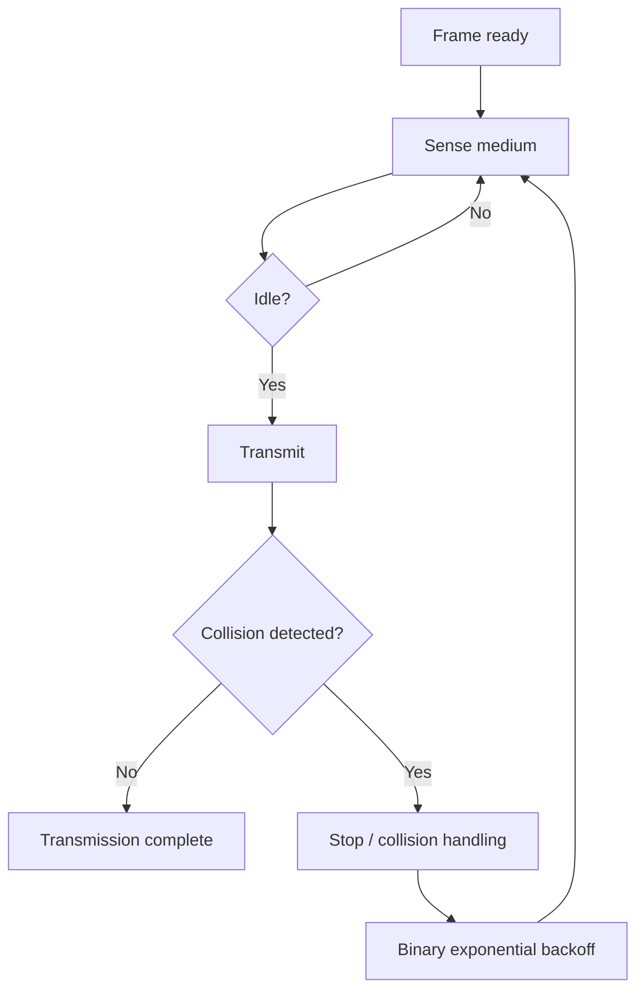

---

# Binary Exponential Backoff

After collisions, Ethernet selects a random waiting time from an increasing range.

Conceptually:

```text
1st collision → wait random amount from small range
2nd collision → larger range
3rd collision → even larger range
```

This reduces the probability that the same devices collide again immediately.

---

# Important Modern Ethernet Point

Modern switched full-duplex Ethernet generally does **not** use CSMA/CD for normal operation.

Why?

Because a switch port typically provides:

```text
Dedicated point-to-point link
+
Full duplex
```

Therefore simultaneous transmission and collision detection are unnecessary.

---

# 27. CSMA/CA

CSMA/CA stands for:

> **Carrier Sense Multiple Access with Collision Avoidance**

It is commonly associated with Wi-Fi.

Wireless devices generally cannot depend on collision detection in the same way as traditional shared wired Ethernet.

Therefore, Wi-Fi attempts to **avoid** collisions rather than detect them during transmission.

---

# Basic CSMA/CA

```text
1. Sense channel
2. If busy → wait
3. If idle → use contention/backoff mechanism
4. Transmit
5. Wait for acknowledgment
6. Retransmit if necessary
```

---

# CSMA/CA Diagram

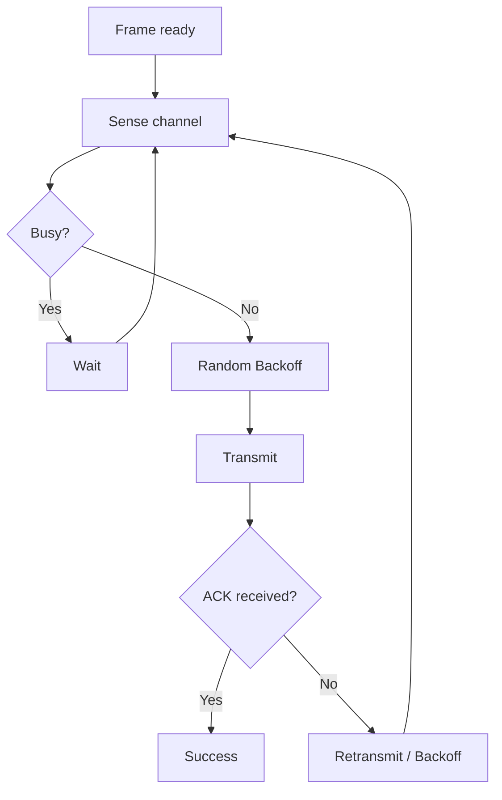

---

# Why Wireless is Difficult

Wireless stations may not hear one another.

Example:

```text
A        Access Point        B

A hears AP
B hears AP

A may not hear B
B may not hear A
```

This is related to the:

> **Hidden terminal problem**

---

# Hidden Terminal

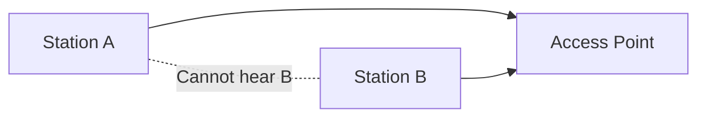

A and B can both transmit toward the AP, potentially causing a collision there.

---

# RTS/CTS

Wi-Fi can optionally use:

```text
RTS = Request to Send
CTS = Clear to Send
```

Conceptually:

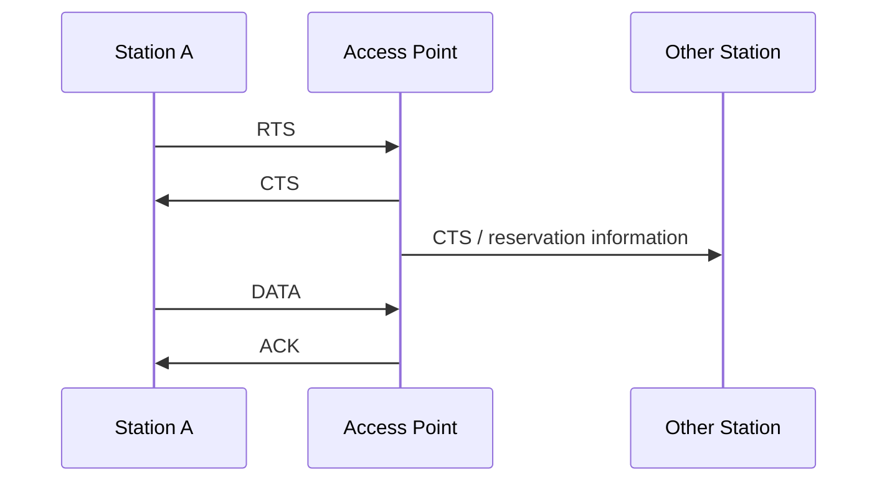

RTS/CTS is intended to reduce certain collision problems; it is not required for every Wi-Fi transmission.

---

# 28. MAC Address

A MAC address identifies a network interface at the link layer.

Typical Ethernet MAC address:

```text
48 bits
```

Example:

```text
00:1A:2B:3C:4D:5E
```

---

# MAC Address Structure

Conceptually, a 48-bit MAC address contains an organizationally assigned portion and an interface-specific portion.

Historically, this is often explained as:

```text
First 24 bits → OUI
Last 24 bits  → Interface identifier
```

The exact addressing space also contains locally administered addresses, so this split is not universally descriptive of every possible MAC address.

---

# MAC vs IP

```text
MAC Address
   ↓
Local-link identity/address

IP Address
   ↓
Logical network address
```

Example:

```text
MAC:
AA:BB:CC:DD:EE:FF

IP:
192.168.1.10
```

---

# 29. Ethernet

Ethernet is one of the most widely used LAN technologies.

It is standardized primarily under:

> IEEE 802.3

Ethernet operates mainly at:

```text
Data Link Layer
+
Physical Layer
```

---

# Ethernet Characteristics

Traditional Ethernet concepts include:

* MAC addressing
* Frames
* FCS/CRC-based error detection
* Shared-media Ethernet historically used CSMA/CD
* Modern switched Ethernet usually uses full-duplex links

---

# Ethernet Speeds

Examples include:

```text
10 Mb/s
100 Mb/s
1 Gb/s
10 Gb/s
40 Gb/s
100 Gb/s
400 Gb/s
```

Modern Ethernet standards support many higher speeds.

---

# 30. Ethernet Frame

A simplified Ethernet frame contains:

```text
+----------+----------+----------+----------+----------+
| Preamble | Dest MAC | Src MAC  | Type/Len | Payload  |
+----------+----------+----------+----------+----------+
                                           |
                                           v
                                     +----------+
                                     | FCS/CRC  |
                                     +----------+
```

---

# Important Ethernet Fields

## Preamble

Used for synchronization at the physical layer.

It is typically:

```text
7 bytes
```

---

## Start Frame Delimiter

Indicates the start of the actual frame.

```text
1 byte
```

---

## Destination MAC

Identifies the intended receiving MAC address.

---

## Source MAC

Identifies the sender.

---

## Type/Length

Depending on the Ethernet format:

* EtherType identifies the encapsulated upper-layer protocol.
* IEEE 802.3 length interpretation is used in other cases.

Examples of EtherTypes include:

```text
IPv4
IPv6
ARP
```

---

## Payload

Contains data from the network layer.

For standard Ethernet II framing, the typical payload is:

```text
46–1500 bytes
```

for ordinary non-jumbo Ethernet, with padding used when necessary.

---

## FCS

FCS stands for:

> **Frame Check Sequence**

It provides error detection, typically using CRC.

---

# Ethernet Frame Size

Traditional Ethernet frame size is commonly:

```text
64 bytes minimum
1518 bytes maximum
```

These figures refer to a standard Ethernet frame without an optional VLAN tag and exclude the preamble/SFD.

With an 802.1Q VLAN tag, the maximum frame size becomes:

```text
1522 bytes
```

---

# 31. Ethernet Bridging

A **bridge** connects network segments at the Data Link Layer.

Modern Ethernet switches are essentially multi-port bridges.

---

# Bridge Function

A bridge:

* Receives Ethernet frames
* Examines MAC addresses
* Learns which MAC addresses are reachable through which ports
* Forwards frames selectively
* Filters frames when appropriate
* Floods frames when the destination is unknown or broadcast

---

# Bridge Diagram

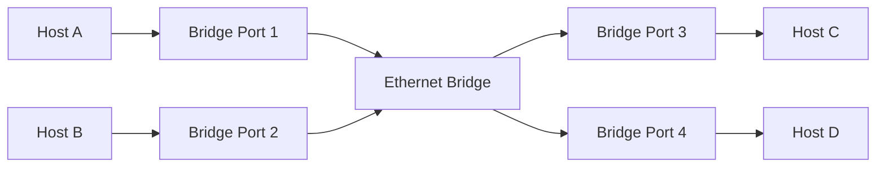

---

# Why Bridges Are Useful

Suppose many devices share a large collision domain.

A bridge/switch can divide the network into separate segments.

```text
Before:

A B C D E F
 \ | | | | /
   Shared LAN


After:

A B C → Switch ← D E F
```

This reduces unnecessary traffic and allows better use of links.

---

# 32. Bridge Learning Process

A bridge builds a:

> **MAC Address Table**

Example:

| MAC Address       | Port |
| ----------------- | ---: |
| AA:AA:AA:AA:AA:AA |    1 |
| BB:BB:BB:BB:BB:BB |    2 |
| CC:CC:CC:CC:CC:CC |    3 |

---

# How Does the Bridge Learn?

Suppose host A sends a frame.

```text
Source MAC = A
Destination MAC = C
```

The bridge receives the frame on:

```text
Port 1
```

It learns:

```text
A → Port 1
```

It looks for C.

If C is unknown:

```text
Flood
```

out the appropriate ports.

---

# Learning Diagram

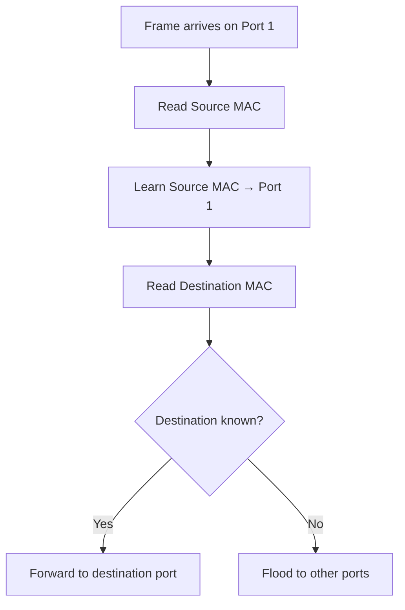

---

# 33. Forwarding and Filtering

A bridge makes forwarding decisions based on its MAC table.

---

## Case 1 — Destination Known

Suppose:

```text
Destination C → Port 3
```

Frame arrives at Port 1.

The bridge forwards only to:

```text
Port 3
```

---

## Case 2 — Destination Unknown

Suppose destination MAC is not in the table.

The bridge:

```text
Floods
```

the frame out all appropriate ports except the incoming port.

---

## Case 3 — Broadcast

Example:

```text
FF:FF:FF:FF:FF:FF
```

The bridge floods the broadcast within the broadcast domain.

---

## Case 4 — Destination on Same Incoming Port

Suppose:

```text
Destination C → Port 1
```

and the frame entered through Port 1.

The bridge does not forward it to other ports.

This is called:

> **Filtering**

---

# Forwarding vs Filtering

| Condition                         | Action                 |
| --------------------------------- | ---------------------- |
| Destination known on another port | Forward                |
| Destination unknown               | Flood                  |
| Broadcast destination             | Flood                  |
| Destination on same incoming port | Filter/drop forwarding |

---

# 34. Broadcast and Collision Domains

## Collision Domain

A collision domain is a network area in which simultaneous transmissions could potentially interfere with one another on a shared medium.

---

# Hub

With a traditional Ethernet hub:

```text
A
|
B — HUB — C
|
D
```

All ports are part of the same collision domain.

---

# Switch

With a switch:

```text
A ─┐
B ─┼─ Switch ─ C
D ─┘
```

Each switch port is generally its own collision domain in full-duplex Ethernet.

---

# Broadcast Domain

A broadcast domain is the set of devices that receive a Layer-2 broadcast.

A normal Layer-2 switch forwards broadcasts within the same VLAN/broadcast domain.

A router normally separates broadcast domains.

---

# Router vs Switch

```text
Switch
 ↓
Layer 2
 ↓
MAC addresses
 ↓
Broadcast remains within VLAN

Router
 ↓
Layer 3
 ↓
IP addresses
 ↓
Separates broadcast domains
```

---

# 35. Switch vs Hub vs Bridge

| Feature              | Hub      | Bridge                           | Switch                                |
| -------------------- | -------- | -------------------------------- | ------------------------------------- |
| OSI layer            | Physical | Data Link                        | Data Link                             |
| Uses MAC table       | No       | Yes                              | Yes                                   |
| Forwards selectively | No       | Yes                              | Yes                                   |
| Collision domains    | Shared   | Segmented                        | Per-port in full-duplex Ethernet      |
| Modern use           | Rare     | Historical/specific              | Very common                           |
| Broadcast forwarding | Yes      | Yes within same broadcast domain | Yes within same VLAN/broadcast domain |

---

# Why a Switch Is Called a Multi-Port Bridge

A traditional bridge typically connects a small number of LAN segments.

A switch performs essentially the same Layer-2 forwarding function but with many ports and hardware/software optimized for switching.

Therefore:

```text
Switch ≈ Multi-port Bridge
```

---

# 36. Integrated Data Link Layer Flow

Suppose Host A wants to send data to Host B on the same Ethernet LAN.

---

## Step 1 — Network Layer Creates Packet

Suppose IP creates:

```text
IP Header + Data
```

---

## Step 2 — Data Link Layer Creates Frame

Ethernet adds:

```text
Destination MAC
Source MAC
Type
FCS
```

Result:

```text
Ethernet Frame
```

---

## Step 3 — MAC Determines Medium Access

If the medium/access technology requires contention handling, the MAC procedure determines when the host may transmit.

Modern switched full-duplex Ethernet typically has no collision contention on the link.

---

## Step 4 — Frame Travels

```text
Host A
 ↓
Switch
 ↓
Host B
```

---

## Step 5 — Switch Examines MAC Address

Switch checks:

```text
Destination MAC
```

and its MAC address table.

---

## Step 6 — Switch Forwards

It sends the frame out the appropriate port.

---

# Complete Diagram

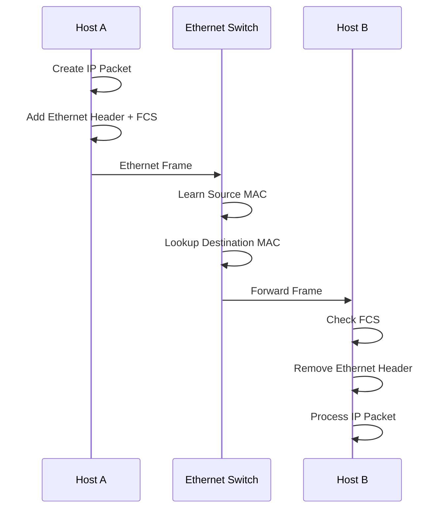

---

# 37. Important Exam Definitions

## Layering

A networking architecture that divides communication functionality into separate layers, with each layer providing services to the layer above and using services from the layer below.

---

## OSI Model

A seven-layer reference model consisting of:

```text
Application
Presentation
Session
Transport
Network
Data Link
Physical
```

---

## TCP/IP Model

A practical Internet protocol architecture commonly represented using:

```text
Application
Transport
Internet
Link
```

---

## Encapsulation

The process in which each protocol layer adds its own header and/or trailer to data received from the layer above.

---

## Decapsulation

The reverse process in which headers/trailers are removed as data moves up the protocol stack at the destination.

---

## Packet Switching

A communication technique in which data is divided into packets that share network resources.

---

## Circuit Switching

A communication technique in which a dedicated communication path/resources are established for a session.

---

## Virtual Circuit

A logical connection established through a packet-switched network where packets follow an established path and routers maintain connection-related state.

---

## Framing

The process of dividing a bit stream into identifiable data-link-layer frames.

---

## Error Detection

The process of determining whether transmitted data has been corrupted.

---

## MAC

The Data Link sublayer responsible for medium access and MAC addressing functions.

---

## Ethernet

A family of LAN technologies standardized mainly under IEEE 802.3.

---

## Bridge

A Layer-2 device that forwards or filters frames based on MAC addresses.

---

## Switch

A multi-port Layer-2 forwarding device that learns MAC addresses and selectively forwards Ethernet frames.

---

# 38. Important Comparisons

# 38.1 OSI vs TCP/IP

| OSI                    | TCP/IP                            |
| ---------------------- | --------------------------------- |
| 7 layers               | Commonly 4 layers                 |
| Reference model        | Protocol architecture/suite       |
| Session layer separate | Usually part of Application       |
| Presentation separate  | Usually part of Application       |
| Physical separate      | Usually part of Link conceptually |

---

# 38.2 Packet vs Circuit Switching

| Packet                       | Circuit                           |
| ---------------------------- | --------------------------------- |
| Shared resources             | Dedicated resources traditionally |
| No dedicated path required   | Dedicated path established        |
| Variable delay               | More predictable after setup      |
| Efficient for bursty traffic | Good for continuous traffic       |
| Packets                      | Continuous circuit/stream         |

---

# 38.3 Datagram vs Virtual Circuit

| Datagram                                | Virtual Circuit                         |
| --------------------------------------- | --------------------------------------- |
| Connectionless                          | Connection-oriented                     |
| No setup required                       | Setup required                          |
| Each packet routed independently        | Packets follow established logical path |
| No per-flow path state required in core | Core maintains VC state                 |
| Packets may take different paths        | Usually same logical path               |

---

# 38.4 Parity vs Checksum vs CRC

| Feature                   | Parity    | Checksum | CRC       |
| ------------------------- | --------- | -------- | --------- |
| Simplicity                | Very high | Moderate | Higher    |
| Detection strength        | Low       | Moderate | High      |
| Common in Ethernet        | No        | No       | Yes       |
| Detects many burst errors | Limited   | Some     | Very good |

---

# 38.5 CSMA/CD vs CSMA/CA

| Feature            | CSMA/CD                                    | CSMA/CA                       |
| ------------------ | ------------------------------------------ | ----------------------------- |
| Full name          | Collision Detection                        | Collision Avoidance           |
| Common association | Shared Ethernet                            | Wi-Fi                         |
| Strategy           | Detect collision after transmission begins | Attempt to avoid collisions   |
| ACK                | Not the core collision mechanism           | Used for wireless reliability |
| Modern relevance   | Mostly historical for shared Ethernet      | Important in Wi-Fi            |

---

# 38.6 Hub vs Switch

| Feature              | Hub               | Switch                             |
| -------------------- | ----------------- | ---------------------------------- |
| Layer                | 1                 | 2                                  |
| MAC learning         | No                | Yes                                |
| Selective forwarding | No                | Yes                                |
| Collision domains    | One shared domain | Typically one per full-duplex port |
| Efficiency           | Low               | High                               |

---

# 39. One-Page Revision

```text
LAYERING
   ↓
Divide networking into logical layers

OSI
   ↓
7 layers

Application
Presentation
Session
Transport
Network
Data Link
Physical

TCP/IP
   ↓
Application
Transport
Internet
Link


SWITCHING

Circuit Switching
   ↓
Dedicated circuit/path

Packet Switching
   ↓
Packets share network resources

Virtual Circuit
   ↓
Logical connection + packet switching


DATA LINK

Framing
   ↓
Identify frame boundaries

Error Detection
   ↓
Parity
Checksum
CRC

MAC
   ↓
Control access to shared medium

ALOHA
   ↓
Transmit and retry

CSMA
   ↓
Listen before transmit

CSMA/CD
   ↓
Detect collision
   ↓
Traditionally shared Ethernet

CSMA/CA
   ↓
Avoid collision
   ↓
Wi-Fi


ETHERNET

MAC Address
   ↓
48-bit address commonly used

Frame
   ↓
Destination MAC
Source MAC
Type/Length
Payload
FCS

Bridge/Switch
   ↓
Learn MAC → Port
   ↓
Forward / Filter / Flood
```

---

# 40. Frequently Asked Exam Questions

## Q1. Why is layering important in computer networks?

Layering provides modularity, abstraction, interoperability, easier implementation, and easier troubleshooting by dividing networking functionality into manageable components.

---

## Q2. Explain the seven layers of the OSI model.

```text
7 Application   → Network services
6 Presentation  → Data representation
5 Session       → Session management
4 Transport     → End-to-end delivery
3 Network       → Routing and logical addressing
2 Data Link     → Frames, MAC, error detection
1 Physical      → Bit transmission
```

---

## Q3. Explain the TCP/IP model.

The commonly used four-layer representation is:

```text
Application
Transport
Internet
Link
```

The Application layer includes protocols such as HTTP, DNS, SMTP, and FTP. Transport includes TCP and UDP. The Internet layer includes IP. The Link layer includes technologies such as Ethernet and Wi-Fi.

---

## Q4. What is packet switching?

Packet switching divides data into packets that share network resources. Packets can be independently forwarded through the network.

---

## Q5. What is circuit switching?

Circuit switching establishes a dedicated communication path/resources for a communication session before transferring data.

---

## Q6. What is virtual circuit switching?

Virtual circuit switching establishes a logical path through a packet-switched network. Packets associated with the connection follow that logical path, and network devices maintain connection-related state.

---

## Q7. What is framing?

Framing is the process of dividing a continuous bit stream into identifiable Data Link Layer units called frames.

---

## Q8. Why is error detection required?

Because bits can be corrupted during transmission due to noise, interference, attenuation, and hardware problems. Error detection allows the receiver to determine whether corruption occurred.

---

## Q9. Explain CRC.

CRC uses polynomial arithmetic over binary data. The sender calculates a remainder using a generator polynomial and appends it to the frame. The receiver performs the same operation and checks the remainder to detect errors.

---

## Q10. What is MAC?

MAC, or Medium Access Control, is a Data Link Layer sublayer responsible for controlling access to a shared medium and supporting link-layer addressing/operation.

---

## Q11. Explain CSMA/CD.

```text
Sense medium
     ↓
If idle → transmit
     ↓
Monitor for collision
     ↓
Collision?
  ↓       ↓
 Yes      No
  ↓        ↓
Backoff   Done
  ↓
Retry
```

It was traditionally used by shared, half-duplex Ethernet.

---

## Q12. Explain CSMA/CA.

CSMA/CA is commonly used in Wi-Fi. A station senses the channel, waits when necessary, uses contention/backoff procedures, transmits when allowed, and may wait for an acknowledgment.

---

## Q13. What is Ethernet bridging?

Ethernet bridging is the process of forwarding and filtering Ethernet frames between LAN segments based on MAC addresses.

---

## Q14. How does a switch learn MAC addresses?

When a frame arrives, the switch reads the source MAC address and associates it with the incoming port.

Example:

```text
Frame arrives at Port 2

Source MAC = AA:BB:CC:DD:EE:FF

Switch learns:

AA:BB:CC:DD:EE:FF → Port 2
```

---

## Q15. What happens when a switch does not know the destination MAC?

The switch floods the frame out its other appropriate ports within the same VLAN/broadcast domain, excluding the incoming port.

---

# Final Mental Model

The whole topic can be remembered as:

```mermaid
flowchart TD
    A["Layering"] --> B["OSI / TCP-IP"]
    B --> C["How data moves"]
    C --> D["Switching"]

    D --> E["Circuit Switching"]
    D --> F["Packet Switching"]
    D --> G["Virtual Circuit"]

    C --> H["Data Link Layer"]

    H --> I["Framing"]
    H --> J["Error Detection"]
    H --> K["MAC"]

    K --> L["ALOHA"]
    K --> M["CSMA"]
    K --> N["CSMA/CD"]
    K --> O["CSMA/CA"]

    H --> P["Ethernet"]
    P --> Q["MAC Address"]
    P --> R["Ethernet Frame"]
    P --> S["Bridge / Switch"]
    S --> T["Learning"]
    S --> U["Forwarding"]
    S --> V["Filtering"]
    S --> W["Flooding"]
```

---

# Ultimate Revision Chain

```text
NETWORKING
    ↓
LAYERING
    ↓
OSI / TCP-IP
    ↓
ENCAPSULATION
    ↓
SWITCHING
    ↓
Circuit / Packet / Virtual Circuit
    ↓
DATA LINK LAYER
    ↓
Framing
    ↓
Error Detection
    ↓
MAC
    ↓
Ethernet
    ↓
Bridges / Switches
```

The most important distinctions to memorize are:

```text
OSI
→ 7-layer reference model

TCP/IP
→ Practical Internet protocol architecture

Circuit Switching
→ Dedicated path/resources

Packet Switching
→ Packets share resources

Virtual Circuit
→ Logical path through packet network

Framing
→ Defines Data Link Layer frame boundaries

Parity
→ Simple error detection

Checksum
→ Arithmetic-based error detection

CRC
→ Strong error detection using polynomial division

MAC
→ Controls access to shared medium

CSMA/CD
→ Collision detection
→ Traditional shared Ethernet

CSMA/CA
→ Collision avoidance
→ Wi-Fi

Bridge/Switch
→ MAC-based forwarding

Hub
→ Repeats bits, no MAC learning
```
---
# Computer Networks — Routing, IP, Transport & Application Layer

> **Complete exam-oriented notes** covering:
>
> * Routing protocols: Shortest Path, Flooding, Distance Vector, Link State
> * Fragmentation and IP Addressing
> * IPv4 and CIDR
> * ARP, DHCP, ICMP
> * NAT
> * Transport Layer: Flow Control, Congestion Control, UDP, TCP, Sockets
> * Application Layer: DNS, SMTP, HTTP, FTP, Email
> * Important tables, examples, comparisons, and Mermaid diagrams

---

# Table of Contents

1. [Routing Protocols](#1-routing-protocols)

   * [What is Routing?](#11-what-is-routing)
   * [Shortest Path Routing](#12-shortest-path-routing)
   * [Flooding](#13-flooding)
   * [Distance Vector Routing](#14-distance-vector-routing)
   * [Link State Routing](#15-link-state-routing)
   * [Distance Vector vs Link State](#16-distance-vector-vs-link-state)
2. [IP Addressing](#2-ip-addressing)

   * [IPv4](#21-ipv4)
   * [IPv4 Address Classes](#22-ipv4-address-classes)
   * [Private IP Addresses](#23-private-ip-addresses)
   * [Public vs Private IP](#24-public-vs-private-ip)
3. [CIDR](#3-cidr)

   * [CIDR Notation](#31-cidr-notation)
   * [Subnet Mask](#32-subnet-mask)
   * [Finding Network and Host Bits](#33-finding-network-and-host-bits)
   * [CIDR Examples](#34-cidr-examples)
4. [IP Fragmentation](#4-ip-fragmentation)

   * [Why Fragmentation is Needed](#41-why-fragmentation-is-needed)
   * [MTU](#42-mtu)
   * [IPv4 Fragmentation Fields](#43-ipv4-fragmentation-fields)
   * [Fragmentation Example](#44-fragmentation-example)
5. [ARP](#5-arp)
6. [DHCP](#6-dhcp)
7. [ICMP](#7-icmp)
8. [NAT](#8-nat)
9. [Transport Layer](#9-transport-layer)

   * [Responsibilities](#91-responsibilities)
   * [Flow Control](#92-flow-control)
   * [Congestion Control](#93-congestion-control)
   * [Flow Control vs Congestion Control](#94-flow-control-vs-congestion-control)
10. [UDP](#10-udp)
11. [TCP](#11-tcp)

    * [TCP Features](#111-tcp-features)
    * [TCP Header](#112-tcp-header)
    * [TCP Three-Way Handshake](#113-tcp-three-way-handshake)
    * [TCP Termination](#114-tcp-connection-termination)
    * [TCP Sequence and Acknowledgment Numbers](#115-tcp-sequence-and-acknowledgment-numbers)
12. [Sockets](#12-sockets)
13. [Application Layer](#13-application-layer)

    * [DNS](#131-dns)
    * [HTTP](#132-http)
    * [FTP](#133-ftp)
    * [SMTP](#134-smtp)
    * [Email System](#135-email-system)
14. [Important Port Numbers](#14-important-port-numbers)
15. [Important Comparisons](#15-important-comparisons)
16. [Exam Quick Revision](#16-exam-quick-revision)

---

# 1. Routing Protocols

## 1.1 What is Routing?

**Routing** is the process of selecting a path through a network for packets to travel from a source device to a destination device.

Example:

```text
Computer A
    |
    v
Router R1
    |
    v
Router R2
    |
    v
Router R3
    |
    v
Computer B
```

A router receives a packet and determines:

> "Which next-hop router should I send this packet to?"

The decision is based on the routing table.

---

## Routing Table

A simplified routing table may look like:

| Destination Network | Next Hop    | Interface | Metric |
| ------------------- | ----------- | --------- | -----: |
| 192.168.1.0/24      | Direct      | eth0      |      0 |
| 10.0.0.0/8          | 192.168.1.1 | eth0      |      2 |
| 172.16.0.0/16       | 192.168.2.1 | eth1      |      4 |
| 0.0.0.0/0           | ISP Router  | eth2      |     10 |

### Important terms

**Destination network**

The network the packet needs to reach.

**Next hop**

The next router to which the packet should be sent.

**Metric**

A value representing the cost of a route.

Lower metric usually means a better route.

---

# 1.2 Shortest Path Routing

Shortest path routing attempts to select the route with the **lowest total cost**.

The cost does not necessarily mean physical distance.

It can represent:

* Hop count
* Delay
* Bandwidth
* Reliability
* Administrative cost
* A combination of these

---

## Example

Suppose the topology is:

```mermaid
graph LR
    A((A)) -- 2 --> B((B))
    A -- 5 --> C((C))
    B -- 1 --> C
    B -- 4 --> D((D))
    C -- 1 --> D
```

Possible paths from A to D:

```text
A → B → D

Cost = 2 + 4
     = 6
```

Another path:

```text
A → C → D

Cost = 5 + 1
     = 6
```

Another:

```text
A → B → C → D

Cost = 2 + 1 + 1
     = 4
```

Therefore:

```text
Shortest path = A → B → C → D
Cost = 4
```

---

## Dijkstra's Algorithm

Dijkstra's algorithm is commonly associated with shortest-path calculation when link costs are non-negative.

Basic idea:

1. Start from the source.
2. Give the source a distance of `0`.
3. Give all other nodes an initial distance of infinity.
4. Select the unvisited node with the smallest known distance.
5. Relax/update its neighbors.
6. Mark that node as visited.
7. Repeat until all required nodes are processed.

---

## Dijkstra Example

Network:

```mermaid
graph LR
    A((A)) -- 4 --> B((B))
    A -- 2 --> C((C))
    B -- 1 --> C
    B -- 5 --> D((D))
    C -- 8 --> D
    C -- 10 --> E((E))
    D -- 2 --> E
```

Starting from A:

```text
A = 0

B = 4
C = 2
```

Choose C because:

```text
C = 2
```

Update:

```text
B = min(4, 2 + 1)
  = 3

D = min(∞, 2 + 8)
  = 10

E = min(∞, 2 + 10)
  = 12
```

Choose B:

```text
B = 3
```

Update:

```text
D = min(10, 3 + 5)
  = 8
```

Choose D:

```text
D = 8
```

Update:

```text
E = min(12, 8 + 2)
  = 10
```

Therefore:

```text
Shortest route from A to E:

A → C → B → D → E

Total cost:

2 + 1 + 5 + 2 = 10
```

---

# 1.3 Flooding

Flooding is a routing technique in which a packet is forwarded through **all possible outgoing links**, except the link from which it arrived.

The idea is:

```text
"Send the packet everywhere."
```

---

## Flooding Diagram

```mermaid
graph LR
    A((Source)) --> B((B))
    A --> C((C))
    A --> D((D))

    B --> E((E))
    C --> E
    D --> E

    E --> F((Destination))
```

Packet from A is copied:

```text
A
├── B
│   └── E
│       └── F
├── C
│   └── E
│       └── F
└── D
    └── E
        └── F
```

Multiple copies may reach the destination.

---

## Problem with Flooding

Flooding can create an enormous number of duplicate packets.

Therefore, practical systems need mechanisms to control flooding.

### Techniques

**Hop count / TTL**

Every packet contains a maximum lifetime.

Example:

```text
TTL = 5
```

Each router decreases TTL.

When TTL becomes `0`, the packet is discarded.

---

## Advantages of Flooding

* Very robust
* Easy to implement
* Does not require complete routing knowledge
* Can find a path if one exists
* Useful in certain routing and discovery algorithms

## Disadvantages

* Generates duplicate packets
* High bandwidth usage
* Can create congestion
* Poor scalability

---

# 1.4 Distance Vector Routing

Distance Vector routing is a routing approach where each router maintains information about:

```text
Destination → Distance → Next Hop
```

A router does **not** need complete knowledge of the network topology.

Instead, routers exchange routing information with their neighbors.

---

## Basic Idea

Suppose:

```mermaid
graph LR
    A((A)) -- 1 --> B((B))
    B -- 2 --> C((C))
    A -- 7 --> C
```

Initially A knows:

```text
A → B = 1
A → C = 7
```

B knows:

```text
B → A = 1
B → C = 2
```

A can learn from B:

```text
B → C = 2
```

Therefore:

```text
A → B → C

Cost = 1 + 2
     = 3
```

A updates:

```text
A → C = 3
```

instead of:

```text
A → C = 7
```

---

## Bellman-Ford Concept

Distance vector routing is based on the Bellman-Ford idea.

The basic equation can be written as:

```text
D_x(y) = min_v { c(x,v) + D_v(y) }
```

Where:

* `D_x(y)` = estimated cost from router `x` to destination `y`
* `v` = neighboring router
* `c(x,v)` = cost from x to neighbor v
* `D_v(y)` = neighbor v's distance to destination y

Meaning:

> "My best path to destination Y is the minimum of the cost to a neighbor plus that neighbor's cost to Y."

---

## Distance Vector Characteristics

| Property                   | Distance Vector      |
| -------------------------- | -------------------- |
| Knowledge                  | Neighbor information |
| Algorithm                  | Bellman-Ford         |
| Updates                    | Periodic / triggered |
| Convergence                | Usually slower       |
| Complexity                 | Lower                |
| Network topology knowledge | Partial              |
| Example protocol           | RIP                  |

---

## Count-to-Infinity Problem

One major problem with distance-vector routing is the **count-to-infinity problem**.

Consider:

```mermaid
graph LR
    A((A)) --- B((B))
    B --- C((C))
```

Suppose C becomes unreachable.

B may incorrectly believe A has a route to C.

A may believe B has a route to C.

They keep increasing their metric:

```text
2
3
4
5
6
...
```

until reaching a configured maximum value.

---

## Techniques to Reduce Count-to-Infinity

### Split Horizon

A router does not advertise a route back through the interface from which it learned that route.

### Route Poisoning

A failed route is advertised with an infinite metric.

### Poison Reverse

A router explicitly advertises an unusable route back to the neighbor from which it learned it.

---

# 1.5 Link State Routing

In Link State routing, every router attempts to build a map of the network topology.

Each router learns:

* Its neighbors
* Cost of links
* Network topology information

The router then independently calculates the shortest paths.

---

## Link State Process

```mermaid
flowchart TD
    A[Discover Neighbors] --> B[Measure Link Costs]
    B --> C[Create Link State Information]
    C --> D[Distribute Link State Advertisements]
    D --> E[Build Link State Database]
    E --> F[Run Shortest Path Algorithm]
    F --> G[Build Routing Table]
```

---

## Link State Database

Each router builds a representation like:

```text
A connected to B with cost 2
A connected to C with cost 5
B connected to C with cost 1
C connected to D with cost 3
```

All routers can therefore build a topology graph.

---

## Link State Algorithm

Usually associated with:

```text
Dijkstra / Shortest Path First
```

---

## Examples

A major example of a link-state routing protocol is:

```text
OSPF
```

Another is:

```text
IS-IS
```

---

# 1.6 Distance Vector vs Link State

| Feature             | Distance Vector      | Link State                 |
| ------------------- | -------------------- | -------------------------- |
| Network knowledge   | Neighbor-based       | Full topology              |
| Algorithm           | Bellman-Ford         | Dijkstra                   |
| Routing information | Distance + direction | Link states                |
| Convergence         | Usually slower       | Usually faster             |
| CPU requirement     | Lower                | Higher                     |
| Memory requirement  | Lower                | Higher                     |
| Network map         | No complete map      | Yes                        |
| Example             | RIP                  | OSPF                       |
| Routing loops       | More susceptible     | Generally less susceptible |
| Updates             | Routing vectors      | Link-state information     |

---

# 2. IP Addressing

An IP address identifies a network interface at the Internet/network layer.

An IPv4 address is:

```text
32 bits
```

Example:

```text
192.168.1.10
```

It is written using four decimal octets.

Each octet is:

```text
8 bits
```

Therefore:

```text
8 + 8 + 8 + 8 = 32 bits
```

---

# 2.1 IPv4

IPv4 address example:

```text
192.168.1.10
```

Binary representation:

```text
192       .168       .1        .10

11000000  .10101000  .00000001 .00001010
```

---

## IPv4 Address Structure

An IPv4 address consists conceptually of:

```text
Network Portion + Host Portion
```

Example:

```text
192.168.1.25/24
```

The `/24` means:

```text
First 24 bits = network
Remaining 8 bits = host
```

Therefore:

```text
Network = 192.168.1.0

Host = 25
```

---

# 2.2 IPv4 Address Classes

Historically, IPv4 used classful addressing.

| Class | First Octet | Default Mask | Typical Use           |
| ----- | ----------: | ------------ | --------------------- |
| A     |       1–126 | /8           | Large networks        |
| B     |     128–191 | /16          | Medium networks       |
| C     |     192–223 | /24          | Small networks        |
| D     |     224–239 | N/A          | Multicast             |
| E     |     240–255 | N/A          | Experimental/reserved |

> Modern networks generally use **CIDR** instead of classful addressing.

---

## Special IPv4 Ranges

Some important ranges:

| Address/Range     | Meaning                             |
| ----------------- | ----------------------------------- |
| `0.0.0.0`         | Unspecified / default route context |
| `127.0.0.0/8`     | Loopback                            |
| `255.255.255.255` | Limited broadcast                   |
| `169.254.0.0/16`  | Link-local IPv4                     |
| `10.0.0.0/8`      | Private                             |
| `172.16.0.0/12`   | Private                             |
| `192.168.0.0/16`  | Private                             |

---

# 2.3 Private IP Addresses

Private IPv4 ranges are used inside private networks.

### Range 1

```text
10.0.0.0/8
```

Range:

```text
10.0.0.0
to
10.255.255.255
```

### Range 2

```text
172.16.0.0/12
```

Range:

```text
172.16.0.0
to
172.31.255.255
```

### Range 3

```text
192.168.0.0/16
```

Range:

```text
192.168.0.0
to
192.168.255.255
```

---

# 2.4 Public vs Private IP

| Feature                          | Public IP      | Private IP     |
| -------------------------------- | -------------- | -------------- |
| Internet routable                | Yes, normally  | No             |
| Used internally                  | Sometimes      | Commonly       |
| Globally unique                  | Yes            | No             |
| Requires NAT for Internet access | Not inherently | Commonly       |
| Example                          | `8.8.8.8`      | `192.168.1.10` |

---

# 3. CIDR

CIDR stands for:

> **Classless Inter-Domain Routing**

CIDR replaced the rigid classful addressing system with flexible network prefixes.

---

# 3.1 CIDR Notation

CIDR notation looks like:

```text
IP-address / prefix-length
```

Example:

```text
192.168.1.0/24
```

The `/24` means:

```text
24 bits = network prefix
8 bits = host portion
```

---

## CIDR Examples

```text
10.0.0.0/8
192.168.1.0/24
172.16.0.0/16
192.168.10.0/28
```

---

# 3.2 Subnet Mask

The prefix length can be converted to a subnet mask.

Examples:

| CIDR | Subnet Mask     | Host Bits |
| ---- | --------------- | --------: |
| /8   | 255.0.0.0       |        24 |
| /16  | 255.255.0.0     |        16 |
| /24  | 255.255.255.0   |         8 |
| /25  | 255.255.255.128 |         7 |
| /26  | 255.255.255.192 |         6 |
| /27  | 255.255.255.224 |         5 |
| /28  | 255.255.255.240 |         4 |
| /29  | 255.255.255.248 |         3 |
| /30  | 255.255.255.252 |         2 |
| /32  | 255.255.255.255 |         0 |

---

# 3.3 Finding Network and Host Bits

Suppose:

```text
192.168.1.10/24
```

There are:

```text
32 total bits
```

Network bits:

```text
24
```

Host bits:

```text
32 - 24 = 8
```

Number of addresses:

```text
2^8 = 256
```

Traditional subnet usable host count:

```text
256 - 2 = 254
```

The subtraction accounts for:

```text
Network address
Broadcast address
```

---

# 3.4 CIDR Examples

## Example 1: /24

```text
192.168.1.0/24
```

Host bits:

```text
32 - 24 = 8
```

Total addresses:

```text
2^8 = 256
```

Traditional usable hosts:

```text
254
```

Network address:

```text
192.168.1.0
```

Broadcast:

```text
192.168.1.255
```

Usable range:

```text
192.168.1.1
-
192.168.1.254
```

---

## Example 2: /26

```text
192.168.1.0/26
```

Host bits:

```text
32 - 26
= 6
```

Total:

```text
2^6
= 64
```

Traditional usable hosts:

```text
62
```

Subnets within a /24:

```text
256 / 64 = 4
```

Therefore:

```text
192.168.1.0/26
192.168.1.64/26
192.168.1.128/26
192.168.1.192/26
```

---

## Example 3: /30

```text
192.168.1.0/30
```

Host bits:

```text
2
```

Total addresses:

```text
2^2 = 4
```

Traditional usable hosts:

```text
2
```

Example:

```text
Network:
192.168.1.0

Usable:
192.168.1.1
192.168.1.2

Broadcast:
192.168.1.3
```

A /30 was traditionally common for point-to-point IPv4 links.

---

# CIDR Visualization

```mermaid
graph LR
    A[32-bit IPv4 address] --> B[Network Prefix]
    A --> C[Host Portion]

    B --> D["Prefix example: /24"]
    C --> E["Remaining 8 bits"]
```

---

# 4. IP Fragmentation

## 4.1 Why Fragmentation is Needed

Different networks can support different maximum packet sizes.

This maximum size is called:

> **MTU — Maximum Transmission Unit**

Example:

```text
Sender packet = 4000 bytes
Network MTU = 1500 bytes
```

The packet may need to be fragmented in IPv4 so that each fragment fits within the MTU.

---

# 4.2 MTU

Typical Ethernet MTU:

```text
1500 bytes
```

This is not a universal value; different technologies can use different MTUs.

---

## Fragmentation Example

Suppose:

```text
IPv4 packet = 4000 bytes
Header = 20 bytes
Payload = 3980 bytes
MTU = 1500 bytes
```

Each fragment needs its own IPv4 header.

Maximum payload per fragment:

```text
1500 - 20
= 1480 bytes
```

Payload:

```text
3980 bytes
```

Fragments:

```text
Fragment 1 → 1480 bytes payload
Fragment 2 → 1480 bytes payload
Fragment 3 → 1020 bytes payload
```

Total:

```text
1480 + 1480 + 1020
= 3980
```

---

# 4.3 IPv4 Fragmentation Fields

Important IPv4 header fields related to fragmentation:

### Identification

Used to identify fragments belonging to the same original IPv4 datagram.

### Flags

Important flags include:

```text
DF = Don't Fragment
MF = More Fragments
```

### Fragment Offset

Identifies where a fragment belongs in the original payload.

The offset is represented in units of:

```text
8 bytes
```

---

# Fragmentation Diagram

```mermaid
flowchart TD
    A["Original IPv4 Packet<br/>4000 bytes"] --> B["Fragment 1<br/>1500 bytes"]
    A --> C["Fragment 2<br/>1500 bytes"]
    A --> D["Fragment 3<br/>1060 bytes"]

    B --> E[Network]
    C --> E
    D --> E

    E --> F["Destination"]
    F --> G[Reassembly]
```

---

# Fragment Offset Example

Suppose:

```text
Fragment 1 payload = 1480 bytes
```

Fragment 1 offset:

```text
0
```

Fragment 2 starts at byte:

```text
1480
```

Therefore fragment offset:

```text
1480 / 8
= 185
```

Fragment 3 starts at:

```text
1480 + 1480
= 2960
```

Offset:

```text
2960 / 8
= 370
```

---

# Important Point

IPv4 fragmentation can happen when:

```text
Packet size > outgoing link MTU
```

IPv6 differs significantly: routers do not fragment IPv6 packets in transit; fragmentation is performed by the source using the Fragment extension header.

---

# 5. ARP

ARP stands for:

> **Address Resolution Protocol**

ARP is used in IPv4 local networks to find the:

```text
MAC address
```

associated with an:

```text
IPv4 address
```

---

## Why ARP is Needed

Suppose:

```text
PC A:
IP = 192.168.1.10
MAC = AA:AA:AA:AA:AA:AA
```

PC A wants to communicate with:

```text
192.168.1.20
```

It knows the destination IP.

But Ethernet delivery requires a:

```text
MAC address
```

Therefore, PC A sends an ARP request.

---

# ARP Process

```mermaid
sequenceDiagram
    participant A as Host A
    participant LAN as Local Network
    participant B as Host B

    A->>LAN: ARP Request: Who has 192.168.1.20?
    LAN-->>B: Broadcast request
    B->>A: ARP Reply: 192.168.1.20 is at BB:BB:BB:BB:BB:BB
    A->>B: Ethernet frame sent to destination MAC
```

---

## ARP Request

ARP request is typically broadcast on the local LAN:

```text
Destination MAC:
FF:FF:FF:FF:FF:FF
```

Meaning:

> "Everyone on this local broadcast domain, tell me who owns this IP."

---

## ARP Reply

The host owning the IP responds with its MAC address.

The sender can then cache the mapping.

Example:

```text
192.168.1.20
        ↓
BB:BB:BB:BB:BB:BB
```

---

# ARP Cache

Operating systems maintain an ARP cache/table.

Example:

```text
Internet Address      Physical Address
192.168.1.1           AA-BB-CC-DD-EE-FF
192.168.1.20          BB-BB-BB-BB-BB-BB
```

---

# 6. DHCP

DHCP stands for:

> **Dynamic Host Configuration Protocol**

DHCP automatically provides network configuration to clients.

It can provide:

* IP address
* Subnet mask
* Default gateway
* DNS server
* Lease duration
* Other configuration options

---

# DHCP DORA Process

The classic DHCP process is:

```text
D = Discover
O = Offer
R = Request
A = Acknowledge
```

---

## DHCP Diagram

```mermaid
sequenceDiagram
    participant C as DHCP Client
    participant S as DHCP Server

    C->>S: DHCP Discover
    S->>C: DHCP Offer
    C->>S: DHCP Request
    S->>C: DHCP ACK
```

---

## Step 1 — DHCP Discover

Client does not have an IP address yet.

It broadcasts:

```text
DHCP Discover
```

Meaning:

> "Is there a DHCP server available?"

---

## Step 2 — DHCP Offer

The DHCP server offers configuration.

Example:

```text
IP:
192.168.1.100

Subnet:
255.255.255.0

Gateway:
192.168.1.1

DNS:
8.8.8.8
```

---

## Step 3 — DHCP Request

The client requests the offered configuration.

---

## Step 4 — DHCP ACK

Server confirms the lease.

Client can now configure itself.

---

# DHCP Ports

DHCP uses UDP.

```text
Server = UDP 67
Client = UDP 68
```

---

# 7. ICMP

ICMP stands for:

> **Internet Control Message Protocol**

ICMP is used for network diagnostics and error/control messaging.

It is associated with the network layer and is carried inside IP packets.

---

## Common ICMP Uses

### Ping

Uses:

```text
ICMP Echo Request
ICMP Echo Reply
```

### Traceroute

Typically relies on TTL expiration and ICMP responses, although implementation details can vary.

### Error Reporting

Examples include:

```text
Destination Unreachable
Time Exceeded
```

---

# Ping Diagram

```mermaid
sequenceDiagram
    participant A as Host A
    participant B as Host B

    A->>B: ICMP Echo Request
    B->>A: ICMP Echo Reply
```

---

# ICMP and Ping

Example command:

```bash
ping google.com
```

Conceptually:

```text
Host
 |
 | ICMP Echo Request
 v
Server
 |
 | ICMP Echo Reply
 v
Host
```

Ping can help determine:

* Reachability
* Round-trip time
* Packet loss

---

# 8. NAT

NAT stands for:

> **Network Address Translation**

NAT modifies IP addressing information as traffic passes through a router/firewall.

NAT is commonly used to allow many private hosts to share a public IPv4 address.

---

# Why NAT?

Suppose a home network contains:

```text
Laptop:
192.168.1.10

Phone:
192.168.1.11

PC:
192.168.1.12
```

These private addresses are not directly routable across the public Internet.

The router may have:

```text
Public IP:
203.0.113.20
```

NAT translates internal connections to the public address.

---

# NAT Diagram

```mermaid
flowchart LR
    A["Laptop<br/>192.168.1.10"] --> R["NAT Router<br/>Public: 203.0.113.20"]
    B["Phone<br/>192.168.1.11"] --> R
    C["PC<br/>192.168.1.12"] --> R
    R --> I["Internet"]
```

---

# NAT Example

Internal client:

```text
192.168.1.10:50000
```

External server:

```text
93.184.216.34:443
```

Router may translate:

```text
192.168.1.10:50000
```

into:

```text
203.0.113.20:40001
```

The NAT device keeps a translation table:

| Private IP:Port    | Public IP:Port     | Destination       |
| ------------------ | ------------------ | ----------------- |
| 192.168.1.10:50000 | 203.0.113.20:40001 | 93.184.216.34:443 |

Because ports are also translated, this is commonly called:

> **PAT — Port Address Translation**

PAT is one common form of NAT.

---

# Types of NAT

| Type        | Description                                                        |
| ----------- | ------------------------------------------------------------------ |
| Static NAT  | One private IP ↔ one public IP                                     |
| Dynamic NAT | Private addresses mapped from a public pool                        |
| PAT         | Many private addresses share one/more public addresses using ports |

---

# Advantages of NAT

* Conserves IPv4 addresses
* Allows private networks to use private addressing
* Makes address changes easier internally
* Can provide a degree of network hiding

---

# Disadvantages

* Breaks the original end-to-end address transparency
* Can complicate peer-to-peer communication
* Some protocols need special NAT handling
* Incoming connections can require port forwarding

---

# 9. Transport Layer

The transport layer provides process-to-process communication.

The two major transport protocols are:

```text
TCP
UDP
```

---

# 9.1 Responsibilities

Transport layer can provide:

* Process-to-process delivery
* Multiplexing and demultiplexing
* Segmentation
* Reassembly
* Reliability
* Flow control
* Congestion control
* Connection management

Not every transport protocol provides every feature.

---

# Port Numbers

Transport protocols use port numbers.

Example:

```text
Client:
192.168.1.10:50000

Server:
93.184.216.34:443
```

The server process is identified by:

```text
Port 443
```

---

# Multiplexing and Demultiplexing

A computer can run multiple applications simultaneously.

For example:

```text
Browser → port 51000
Game → port 52000
Chat → port 53000
```

The transport layer uses port numbers to deliver incoming data to the correct application.

---

# 9.2 Flow Control

Flow control prevents a fast sender from overwhelming a slow receiver.

Consider:

```text
Sender:
100 MB/s

Receiver:
10 MB/s
```

Without flow control, the sender can transmit data faster than the receiver can process it.

This causes receiver buffers to fill.

---

## Flow Control Diagram

```mermaid
flowchart LR
    A["Fast Sender"] --> B["Network"]
    B --> C["Slow Receiver"]
    C --> D["Receive Buffer"]

    D -. "Feedback / Window" .-> A
```

TCP uses a **receive window** to help control how much unacknowledged data a receiver is willing to accept.

---

# 9.3 Congestion Control

Congestion control protects the **network** from excessive traffic.

Imagine:

```text
Many senders
      |
      v
Network router
      |
      v
Limited link
```

Too much traffic can cause:

* Queue buildup
* Packet loss
* Delay
* Reduced throughput

---

# Flow Control vs Congestion Control

| Feature       | Flow Control                 | Congestion Control               |
| ------------- | ---------------------------- | -------------------------------- |
| Protects      | Receiver                     | Network                          |
| Problem       | Sender too fast for receiver | Too much traffic in network      |
| Scope         | Sender ↔ Receiver            | Entire network path              |
| TCP mechanism | Receive window               | Congestion window and algorithms |
| Main concern  | Receiver capacity            | Network capacity                 |

---

# Congestion Control Concepts

TCP commonly uses mechanisms such as:

```text
Slow Start
Congestion Avoidance
Fast Retransmit
Fast Recovery
```

Modern TCP implementations can use different congestion-control algorithms, but these concepts are fundamental for understanding TCP.

---

# 9.3.1 Slow Start

Despite its name, slow start can increase the congestion window rapidly.

Conceptually:

```text
cwnd:
1
2
4
8
16
...
```

The exact behavior depends on TCP implementation and conditions.

---

# 9.3.2 Congestion Avoidance

After reaching an appropriate threshold, TCP generally increases the sending window more cautiously.

Conceptually:

```text
Slow Start:
rapid increase

Congestion Avoidance:
more gradual increase
```

---

# 9.3.3 Packet Loss

TCP treats loss as a signal that congestion may exist.

It may respond by reducing the sending rate.

---

# 10. UDP

UDP stands for:

> **User Datagram Protocol**

UDP is a connectionless transport protocol.

It provides:

* Port numbers
* Checksum
* Datagram delivery

It does **not** provide TCP-style reliable ordered delivery.

---

# UDP Characteristics

| Feature             | UDP                             |
| ------------------- | ------------------------------- |
| Connection-oriented | No                              |
| Connection setup    | No                              |
| Reliable delivery   | No                              |
| Ordered delivery    | No                              |
| Flow control        | No TCP-style flow control       |
| Congestion control  | No TCP-style congestion control |
| Retransmission      | No                              |
| Header size         | 8 bytes                         |
| Speed/overhead      | Low                             |
| Data unit           | Datagram                        |

---

# UDP Header

UDP header contains:

```text
Source Port
Destination Port
Length
Checksum
```

Diagram:

```text
+------------------------+
| Source Port            |
+------------------------+
| Destination Port       |
+------------------------+
| Length                 |
+------------------------+
| Checksum               |
+------------------------+
| Data                   |
+------------------------+
```

---

# Why Use UDP?

UDP is useful when applications prefer:

* Low overhead
* Low latency
* Simple communication
* Application-managed reliability
* Timely delivery over retransmitting old data

Examples include:

```text
DNS
DHCP
RTP / real-time media
QUIC transport foundation
```

> Applications using UDP can implement their own reliability, ordering, retries, and congestion mechanisms when necessary.

---

# 11. TCP

TCP stands for:

> **Transmission Control Protocol**

TCP is a connection-oriented, reliable byte-stream transport protocol.

---

# 11.1 TCP Features

TCP provides:

* Connection establishment
* Reliable delivery
* Ordered byte stream
* Error detection
* Retransmission
* Flow control
* Congestion control
* Full-duplex communication
* Multiplexing using ports

---

# TCP vs UDP

| Feature            | TCP                                           | UDP                                     |
| ------------------ | --------------------------------------------- | --------------------------------------- |
| Connection         | Connection-oriented                           | Connectionless                          |
| Reliability        | Yes                                           | No TCP-style reliability                |
| Ordering           | Yes                                           | No                                      |
| Retransmission     | Yes                                           | No                                      |
| Flow control       | Yes                                           | No TCP-style mechanism                  |
| Congestion control | Yes                                           | No TCP-style mechanism                  |
| Header             | Minimum 20 bytes                              | 8 bytes                                 |
| Data model         | Byte stream                                   | Datagram                                |
| Overhead           | Higher                                        | Lower                                   |
| Typical uses       | HTTP(S), SSH, FTP, many application protocols | DNS, DHCP, real-time applications, QUIC |

---

# 11.2 TCP Header

Important fields:

```text
Source Port
Destination Port
Sequence Number
Acknowledgment Number
Header Length
Flags
Window Size
Checksum
Urgent Pointer
Options
```

Simplified diagram:

```text
+----------------------+----------------------+
| Source Port          | Destination Port     |
+----------------------+----------------------+
| Sequence Number                             |
+---------------------------------------------+
| Acknowledgment Number                       |
+---------------------------------------------+
| Header Len | Flags       | Window Size     |
+----------------------+----------------------+
| Checksum             | Urgent Pointer      |
+----------------------+----------------------+
| Options ...                                |
+---------------------------------------------+
| Data ...                                    |
+---------------------------------------------+
```

---

# Important TCP Flags

| Flag | Meaning                                            |
| ---- | -------------------------------------------------- |
| SYN  | Synchronize sequence numbers / initiate connection |
| ACK  | Acknowledgment field is valid                      |
| FIN  | Sender finished sending                            |
| RST  | Reset connection                                   |
| PSH  | Push data to application                           |
| URG  | Urgent pointer significant                         |

---

# 11.3 TCP Three-Way Handshake

TCP establishes a connection using a three-step process.

```text
1. SYN
2. SYN-ACK
3. ACK
```

---

## TCP Handshake Diagram

```mermaid
sequenceDiagram
    participant C as Client
    participant S as Server

    C->>S: SYN, Seq = x
    S->>C: SYN-ACK, Seq = y, Ack = x + 1
    C->>S: ACK, Ack = y + 1

    Note over C,S: TCP connection established
```

---

# Why Three-Way Handshake?

It allows both endpoints to:

* Agree on initial sequence numbers
* Confirm two-way communication
* Establish connection state

---

# Step 1 — SYN

Client sends:

```text
SYN
Seq = x
```

Meaning:

> "I want to establish a TCP connection."

---

# Step 2 — SYN-ACK

Server responds:

```text
SYN
ACK = x + 1
Seq = y
```

Meaning:

> "I received your SYN, and I also want to establish the connection."

---

# Step 3 — ACK

Client responds:

```text
ACK = y + 1
```

Connection is established.

---

# 11.4 TCP Connection Termination

TCP normally uses FIN-based connection termination.

A simplified sequence:

```mermaid
sequenceDiagram
    participant A as Client
    participant B as Server

    A->>B: FIN
    B->>A: ACK
    B->>A: FIN
    A->>B: ACK

    Note over A,B: Connection closed
```

This is commonly called a **four-segment termination**.

---

# Why Four Segments?

A TCP connection is full-duplex.

Each direction can be closed independently.

For example:

```text
A → B : FIN
```

means:

> "I have finished sending."

B may still send remaining data before eventually sending:

```text
FIN
```

---

# 11.5 TCP Sequence and Acknowledgment Numbers

Suppose a client sends:

```text
Sequence Number = 1000
Data = 500 bytes
```

The receiver expects:

```text
1000 + 500
= 1500
```

Therefore the acknowledgment can be:

```text
ACK = 1500
```

Meaning:

> "I have received bytes up to 1499 and expect byte 1500 next."

---

# TCP is a Byte Stream

Suppose an application writes:

```text
Hello
```

then:

```text
World
```

TCP does not preserve application write boundaries.

The receiver sees a continuous byte stream:

```text
HelloWorld
```

Therefore, the application-layer protocol must define its own message boundaries when needed.

---

# TCP Reliability

TCP uses:

```text
Sequence Numbers
Acknowledgments
Checksums
Retransmissions
Timers
```

to provide reliable ordered delivery.

---

# 12. Sockets

A socket is an endpoint used by a program for network communication.

A common conceptual identifier is:

```text
IP address + transport protocol + port
```

For example:

```text
192.168.1.10:5000 TCP
```

---

# TCP Socket Communication

Typical server flow:

```text
socket()
   ↓
bind()
   ↓
listen()
   ↓
accept()
   ↓
read/write
   ↓
close()
```

---

# TCP Server

```mermaid
sequenceDiagram
    participant S as TCP Server
    participant C as TCP Client

    S->>S: socket()
    S->>S: bind()
    S->>S: listen()

    C->>C: socket()
    C->>S: connect()

    S->>S: accept()

    C->>S: send()
    S->>C: send()

    C->>C: close()
    S->>S: close()
```

---

# UDP Socket

UDP does not need:

```text
listen()
accept()
```

in the TCP sense.

Typical UDP communication uses:

```text
socket()
bind()
sendto()
recvfrom()
```

---

# Socket Example

Suppose a web server listens at:

```text
192.168.1.100:8080
```

A client may use:

```text
192.168.1.20:54000
```

Together, the connection can be represented conceptually as:

```text
192.168.1.20:54000
        |
       TCP
        |
192.168.1.100:8080
```

---

# 13. Application Layer

The application layer provides network functionality directly to applications.

Examples:

```text
DNS
HTTP
SMTP
FTP
SSH
DHCP
```

Application protocols define rules such as:

* Message format
* Request/response structure
* Commands
* Status codes
* Data representation

---

# 13.1 DNS

DNS stands for:

> **Domain Name System**

DNS translates domain names into IP addresses and also provides other types of information.

Example:

```text
www.example.com
        ↓
IP address
```

---

# Why DNS Exists

Humans prefer:

```text
google.com
```

Machines communicate using addresses such as:

```text
IPv4:
142.250.x.x

or IPv6:
2001:....
```

DNS provides the translation mechanism.

---

# DNS Hierarchical Structure

DNS is hierarchical.

Conceptually:

```text
.
├── com
│   └── example
│       └── www
│
├── org
│   └── example
│
└── in
    └── example
```

The root is:

```text
.
```

Then come top-level domains:

```text
.com
.org
.net
.in
```

Then authoritative domains.

---

# DNS Resolution

Example:

```text
www.example.com
```

A client may use a recursive DNS resolver.

Simplified process:

```mermaid
sequenceDiagram
    participant C as Client
    participant R as Recursive Resolver
    participant Root as Root DNS
    participant T as TLD DNS
    participant A as Authoritative DNS

    C->>R: Query www.example.com
    R->>Root: Query example.com
    Root->>R: .com nameserver information
    R->>T: Query example.com
    T->>R: Authoritative nameserver information
    R->>A: Query www.example.com
    A->>R: IP address
    R->>C: IP address
```

---

# DNS Records

| Record | Purpose      |
| ------ | ------------ |
| A      | IPv4 address |
| AAAA   | IPv6 address |
| CNAME  | Alias        |
| MX     | Mail server  |
| NS     | Nameserver   |
| TXT    | Text data    |
| PTR    | Reverse DNS  |

---

# DNS Port

Traditional DNS commonly uses:

```text
UDP 53
```

DNS can also use:

```text
TCP 53
```

for situations where TCP is required.

Modern DNS technologies can also use DNS over HTTPS (DoH) or DNS over TLS (DoT), which changes the transport/encryption mechanism.

---

# 13.2 HTTP

HTTP stands for:

> **Hypertext Transfer Protocol**

HTTP is the protocol commonly used for communication between web clients and servers.

---

# HTTP Request/Response Model

```mermaid
sequenceDiagram
    participant B as Browser
    participant S as Web Server

    B->>S: HTTP Request
    S->>B: HTTP Response
```

---

# HTTP Request Example

```http
GET /index.html HTTP/1.1
Host: example.com
Accept: text/html
```

---

# HTTP Response Example

```http
HTTP/1.1 200 OK
Content-Type: text/html
Content-Length: 1234
```

Followed by response data.

---

# Common HTTP Methods

| Method  | Purpose                           |
| ------- | --------------------------------- |
| GET     | Retrieve resource                 |
| POST    | Submit/create/process data        |
| PUT     | Replace/update resource           |
| PATCH   | Partial update                    |
| DELETE  | Delete resource                   |
| HEAD    | Headers only                      |
| OPTIONS | Ask for supported methods/options |

---

# HTTP Status Codes

Status codes are divided into classes.

| Class | Meaning           |
| ----- | ----------------- |
| 1xx   | Informational     |
| 2xx   | Success           |
| 3xx   | Redirection       |
| 4xx   | Client-side error |
| 5xx   | Server-side error |

---

## Common Status Codes

| Code | Meaning                    |
| ---: | -------------------------- |
|  200 | OK                         |
|  201 | Created                    |
|  204 | No Content                 |
|  301 | Moved Permanently          |
|  302 | Found / temporary redirect |
|  304 | Not Modified               |
|  400 | Bad Request                |
|  401 | Unauthorized               |
|  403 | Forbidden                  |
|  404 | Not Found                  |
|  405 | Method Not Allowed         |
|  409 | Conflict                   |
|  429 | Too Many Requests          |
|  500 | Internal Server Error      |
|  502 | Bad Gateway                |
|  503 | Service Unavailable        |

---

# HTTP vs HTTPS

HTTPS means:

```text
HTTP + TLS
```

TLS provides:

* Encryption
* Integrity
* Server authentication

Common HTTPS port:

```text
443
```

Common plain HTTP port:

```text
80
```

---

# HTTP Statelessness

HTTP is conceptually stateless:

> Each request contains the information needed to process it; the protocol itself does not inherently remember previous requests.

State can be implemented with:

* Cookies
* Sessions
* Tokens
* Server-side storage
* Other application mechanisms

---

# 13.3 FTP

FTP stands for:

> **File Transfer Protocol**

FTP is designed for transferring files between hosts.

FTP traditionally uses separate connections for:

```text
Control
Data
```

---

# FTP Connections

Common ports:

```text
TCP 21 → Control connection
TCP 20 → Historically associated with active-mode data connection
```

Modern FTP data connections depend on active/passive mode and can use dynamically selected ports.

---

# FTP Active Mode

Simplified:

```mermaid
sequenceDiagram
    participant C as FTP Client
    participant S as FTP Server

    C->>S: TCP control connection
    C->>S: PORT command
    S->>C: Data connection
    C->>S: FTP commands
    S->>C: File data
```

---

# FTP Passive Mode

In passive mode, the client establishes both control and data connections toward the server.

```mermaid
sequenceDiagram
    participant C as FTP Client
    participant S as FTP Server

    C->>S: TCP control connection
    C->>S: PASV
    S->>C: Server data port
    C->>S: TCP data connection
    S->>C: File data
```

Passive mode is commonly easier to use through NAT/firewalls.

---

# 13.4 SMTP

SMTP stands for:

> **Simple Mail Transfer Protocol**

SMTP is primarily used for:

```text
Sending email
```

and:

```text
Relaying email between mail servers
```

---

# SMTP Port Numbers

Common ports include:

```text
25  → SMTP relay
587 → Message submission
465 → SMTP over TLS in common deployments
```

---

# SMTP Flow

Suppose:

```text
Alice@example.com
```

sends mail to:

```text
Bob@example.net
```

Simplified:

```mermaid
sequenceDiagram
    participant A as Alice's Mail Client
    participant M1 as Sender Mail Server
    participant M2 as Recipient Mail Server
    participant B as Bob's Mailbox

    A->>M1: SMTP submission
    M1->>M2: SMTP relay
    M2->>B: Store message in mailbox
```

---

# SMTP is for Sending

Important distinction:

```text
SMTP → Sending / transferring mail
POP3 → Downloading mail
IMAP → Accessing/synchronizing mailbox
```

---

# 13.5 Email System

An email system normally involves several components.

```text
User Agent
    |
    v
Mail Submission
    |
    v
Outgoing Mail Server
    |
    v
Recipient Mail Server
    |
    v
Recipient Mailbox
    |
    v
POP3 / IMAP
```

---

# Email Architecture Diagram

```mermaid
flowchart LR
    A[Sender Mail Client] --> B[Mail Submission Server]
    B --> C[Sender Mail Server]
    C --> D[Recipient Mail Server]
    D --> E[Recipient Mailbox]
    E --> F[POP3 / IMAP]
    F --> G[Recipient Mail Client]
```

---

# DNS and Email

SMTP commonly relies on DNS MX records to determine which mail servers handle email for a domain.

Example:

```text
example.com
     |
     | MX lookup
     v
mail.example.com
```

Then the sending mail server can connect to the recipient mail server.

---

# IMAP vs POP3

| Feature                 | IMAP                           | POP3                         |
| ----------------------- | ------------------------------ | ---------------------------- |
| Main purpose            | Mailbox access/synchronization | Mail retrieval               |
| Messages kept on server | Usually yes                    | Traditionally downloaded     |
| Multi-device support    | Excellent                      | More limited                 |
| Folder synchronization  | Yes                            | Limited                      |
| Typical use             | Modern multi-device email      | Simple download-based access |

Common ports:

```text
IMAP:
143
993 → IMAP over TLS

POP3:
110
995 → POP3 over TLS
```

---

# 14. Important Port Numbers

| Protocol        |            Port | Transport                                    |
| --------------- | --------------: | -------------------------------------------- |
| FTP Control     |              21 | TCP                                          |
| FTP data        | 20 / negotiated | TCP                                          |
| SSH             |              22 | TCP                                          |
| Telnet          |              23 | TCP                                          |
| SMTP            |              25 | TCP                                          |
| DNS             |              53 | UDP/TCP                                      |
| DHCP Server     |              67 | UDP                                          |
| DHCP Client     |              68 | UDP                                          |
| HTTP            |              80 | TCP                                          |
| POP3            |             110 | TCP                                          |
| IMAP            |             143 | TCP                                          |
| HTTPS           |             443 | TCP traditionally; HTTP/3 uses QUIC over UDP |
| DNS over HTTPS  |             443 | TCP/HTTP or HTTP/3                           |
| SMTP Submission |             587 | TCP                                          |
| IMAPS           |             993 | TCP                                          |
| POP3S           |             995 | TCP                                          |

> Port numbers identify transport-layer services; they are not themselves IP addresses.

---

# 15. Important Comparisons

## 15.1 Shortest Path vs Flooding

| Feature           | Shortest Path                 | Flooding                    |
| ----------------- | ----------------------------- | --------------------------- |
| Main idea         | Select best path              | Send through multiple paths |
| Efficiency        | High                          | Low                         |
| Duplicate packets | No                            | Yes                         |
| Network knowledge | Required/assumed by algorithm | Less required               |
| Bandwidth usage   | Low                           | High                        |
| Reliability       | Good                          | Very high path redundancy   |
| Scalability       | Better                        | Poor                        |

---

# 15.2 Distance Vector vs Link State

```text
Distance Vector:

"I know how far destinations are
through my neighbors."

Link State:

"I know the network topology
and calculate routes myself."
```

---

# 15.3 IPv4 vs MAC Address

| Feature    | IPv4 Address                  | MAC Address                   |
| ---------- | ----------------------------- | ----------------------------- |
| Layer      | Network layer                 | Data link layer               |
| Example    | 192.168.1.10                  | AA:BB:CC:DD:EE:FF             |
| Purpose    | Logical addressing/routing    | Local-link delivery           |
| Scope      | Can be routed across networks | Usually local network/link    |
| Resolution | ARP in IPv4 LANs              | Hardware/interface identifier |

---

# 15.4 ARP vs DNS

| Feature      | ARP                | DNS                                |
| ------------ | ------------------ | ---------------------------------- |
| Maps         | IPv4 → MAC         | Name → IP and other records        |
| Scope        | Local network/link | Distributed Internet naming system |
| Main purpose | Local delivery     | Name resolution                    |
| Example      | 192.168.1.10 → MAC | example.com → IP                   |

---

# 15.5 DHCP vs DNS

| Feature                | DHCP                  | DNS             |
| ---------------------- | --------------------- | --------------- |
| Purpose                | Network configuration | Name resolution |
| Gives IP configuration | Yes                   | No              |
| Resolves domain names  | No                    | Yes             |
| Typical UDP port       | 67/68                 | 53              |

---

# 15.6 TCP vs UDP

```mermaid
flowchart TD
    A{Choose Transport Protocol}

    A -->|Need reliable ordered stream| B[TCP]
    A -->|Need simple datagrams / low overhead| C[UDP]

    B --> D[Reliability]
    B --> E[Flow Control]
    B --> F[Congestion Control]
    B --> G[Ordering]

    C --> H[Low Overhead]
    C --> I[No Connection Setup]
    C --> J[Application Controls Reliability if Needed]
```

---

# 15.7 Flow Control vs Congestion Control

```text
FLOW CONTROL

Question:
"Can the receiver handle this much data?"

Protects:
Receiver


CONGESTION CONTROL

Question:
"Can the network handle this much traffic?"

Protects:
Network
```

---

# 15.8 SMTP vs HTTP

| Feature            | SMTP                       | HTTP                  |
| ------------------ | -------------------------- | --------------------- |
| Main purpose       | Email transport/submission | Web/resource transfer |
| Model              | Mail transfer/submission   | Request/response      |
| Common secure port | 587 / 465                  | 443                   |
| Data               | Email messages             | Web resources/APIs    |

---

# 15.9 HTTP vs FTP

| Feature          | HTTP                       | FTP               |
| ---------------- | -------------------------- | ----------------- |
| Main purpose     | Web resources / APIs       | File transfer     |
| Connection model | Request/response           | Control + data    |
| Common port      | 80/443                     | 21 control        |
| Browser usage    | Extremely common           | Less common today |
| Authentication   | Application/web mechanisms | FTP mechanisms    |

---

# 16. Integrated Network Flow

The following example combines many concepts.

Suppose you open:

```text
https://example.com
```

on a laptop connected through a home router.

---

## Step 1 — DHCP

When the laptop joins the network, it may obtain:

```text
IP:
192.168.1.10

Subnet mask:
255.255.255.0

Gateway:
192.168.1.1

DNS:
192.168.1.1
```

---

## Step 2 — DNS

The browser needs the IP address of:

```text
example.com
```

It asks a DNS resolver.

```text
example.com
      ↓
DNS
      ↓
IP address
```

---

## Step 3 — ARP

The laptop needs the MAC address of the local gateway if the destination is outside the local subnet.

It performs ARP:

```text
192.168.1.1
     ↓
Gateway MAC
```

---

## Step 4 — TCP

For traditional HTTPS over TCP, the client establishes a TCP connection to:

```text
Server IP : 443
```

Three-way handshake:

```text
SYN
   ↓
SYN-ACK
   ↓
ACK
```

---

## Step 5 — TLS

HTTPS uses TLS to establish an encrypted and authenticated secure channel.

---

## Step 6 — HTTP

Browser sends:

```http
GET / HTTP/1.1
Host: example.com
```

Server responds with:

```http
HTTP/1.1 200 OK
```

and the resource body.

---

## Full Flow

```mermaid
sequenceDiagram
    participant L as Laptop
    participant D as DHCP Server
    participant DNS as DNS Resolver
    participant R as Home Router
    participant S as Web Server

    L->>D: DHCP Discover
    D->>L: DHCP Offer
    L->>D: DHCP Request
    D->>L: DHCP ACK

    L->>R: ARP Request
    R->>L: ARP Reply

    L->>DNS: Resolve example.com
    DNS->>L: Server IP

    L->>S: TCP SYN
    S->>L: TCP SYN-ACK
    L->>S: TCP ACK

    L->>S: TLS handshake
    S->>L: TLS responses

    L->>S: HTTP GET
    S->>L: HTTP response
```

---

# 17. End-to-End Networking View

A useful way to understand the entire subject is to follow a message down the networking stack.

```mermaid
flowchart TD
    A[Application Layer<br/>HTTP / DNS / SMTP] --> B[Transport Layer<br/>TCP / UDP]
    B --> C[Network Layer<br/>IPv4 / ICMP]
    C --> D[Data Link Layer<br/>Ethernet / Wi-Fi]
    D --> E[Physical Layer<br/>Signals / Radio / Fiber]
```

At the receiving side:

```text
Physical
   ↓
Data Link
   ↓
Network
   ↓
Transport
   ↓
Application
```

---

# 18. Encapsulation

Suppose an application sends:

```text
Hello
```

The data is encapsulated as it moves down the stack.

```mermaid
flowchart TD
    A["Application Data<br/>Hello"]
    B["TCP Segment<br/>TCP Header + Data"]
    C["IP Packet<br/>IP Header + TCP Segment"]
    D["Ethernet Frame<br/>Ethernet Header + IP Packet + FCS"]

    A --> B
    B --> C
    C --> D
```

---

# Encapsulation Names

| Layer       | Typical Data Unit              |
| ----------- | ------------------------------ |
| Application | Message/Data                   |
| Transport   | Segment (TCP) / Datagram (UDP) |
| Network     | Packet / IP Datagram           |
| Data Link   | Frame                          |
| Physical    | Bits/Signals                   |

---

# 19. Routing — Complete Concept

When a router receives an IP packet:

```mermaid
flowchart TD
    A[Packet Arrives] --> B[Read Destination IP]
    B --> C[Lookup Routing Table]
    C --> D{Route Found?}

    D -->|Yes| E[Select Best Route]
    E --> F[Determine Next Hop]
    F --> G[Forward Packet]

    D -->|No| H[Use Default Route if Available]
    H --> G
```

The routing table is populated/updated through:

```text
Static routing
or
Dynamic routing protocols
```

Dynamic routing can use concepts such as:

```text
Distance Vector
Link State
```

---

# 20. Routing Metric

A routing protocol may consider metrics such as:

| Metric      | Meaning                         |
| ----------- | ------------------------------- |
| Hop Count   | Number of routers crossed       |
| Bandwidth   | Link capacity                   |
| Delay       | Time needed to traverse link    |
| Reliability | Link reliability                |
| Load        | Current utilization             |
| Cost        | Administrative/configured value |

Different protocols use different metrics.

---

# 21. Default Route

A default IPv4 route is written as:

```text
0.0.0.0/0
```

It means:

> "Use this route when no more specific route matches."

Example:

```text
Destination        Next Hop

192.168.1.0/24     Direct
10.0.0.0/8         Router A
0.0.0.0/0          ISP
```

If destination is:

```text
8.8.8.8
```

and no more specific route matches:

```text
0.0.0.0/0
```

is selected.

---

# 22. Longest Prefix Match

Routers do not simply select the first matching route.

They usually select the route with the **longest matching prefix**.

Example:

```text
10.0.0.0/8
10.1.0.0/16
10.1.2.0/24
```

Destination:

```text
10.1.2.100
```

All three may match.

The most specific route is:

```text
10.1.2.0/24
```

Therefore it wins.

---

# 23. Subnetting Formula

For traditional IPv4 subnetting:

If host bits = `h`

Total addresses:

```text
2^h
```

Traditional usable host addresses:

```text
2^h - 2
```

Example:

```text
/27
```

Host bits:

```text
32 - 27
= 5
```

Total:

```text
2^5 = 32
```

Traditional usable:

```text
32 - 2
= 30
```

> The `-2` rule is a common traditional subnetting rule. Certain special-purpose subnet sizes and modern subnet handling have exceptions.

---

# 24. Important Exam Definitions

## Routing

Routing is the process of selecting paths and forwarding packets toward their destination.

## Shortest Path Routing

A routing method that selects a minimum-cost path according to a defined metric.

## Flooding

A routing approach where packets are forwarded through multiple/all outgoing paths, producing possible duplicates.

## Distance Vector

A routing method where routers exchange distance information with neighbors and calculate routes using a Bellman-Ford-style approach.

## Link State

A routing method where routers distribute link-state information and construct a network topology database before calculating shortest paths.

## IPv4

An Internet Protocol using 32-bit logical addresses.

## CIDR

A classless IP addressing and routing scheme represented using prefix length such as `/24`.

## Fragmentation

Dividing an IP packet into smaller fragments to fit the MTU of an outgoing path/interface in IPv4.

## ARP

A protocol used on IPv4 local networks to resolve an IPv4 address to a MAC address.

## DHCP

A protocol used to automatically configure network parameters for hosts.

## ICMP

A protocol used for IP-related error reporting, diagnostics, and control messages.

## NAT

Translation of IP addressing information between different address realms, commonly private and public IPv4 addresses.

## Flow Control

A mechanism that prevents a sender from overwhelming the receiver.

## Congestion Control

A mechanism that adjusts sending behavior to reduce congestion in the network.

## TCP

A reliable, ordered, connection-oriented byte-stream transport protocol.

## UDP

A connectionless datagram transport protocol with low protocol overhead and no TCP-style reliability guarantees.

## Socket

A software communication endpoint used by applications for network communication.

## DNS

A distributed hierarchical naming system used to resolve domain names and provide other DNS records.

## HTTP

An application-layer request/response protocol used for transferring web resources and supporting APIs.

## FTP

A protocol designed for file transfer using separate control and data connections.

## SMTP

A protocol used primarily for email submission and transfer between mail servers.

---

# 25. Most Important Things to Remember for Exams

```text
Shortest Path
    ↓
Find minimum-cost path

Flooding
    ↓
Forward packet through many/all possible paths

Distance Vector
    ↓
"Ask neighbors"
    ↓
Bellman-Ford

Link State
    ↓
"Build network map"
    ↓
Dijkstra

IPv4
    ↓
32 bits

CIDR
    ↓
Network prefix / host portion

ARP
    ↓
IPv4 → MAC

DHCP
    ↓
Obtain IP configuration

ICMP
    ↓
Errors + diagnostics

NAT
    ↓
Private ↔ Public address translation

TCP
    ↓
Reliable + ordered + connection-oriented

UDP
    ↓
Connectionless + low overhead

Flow Control
    ↓
Protect receiver

Congestion Control
    ↓
Protect network

DNS
    ↓
Name resolution

HTTP
    ↓
Web communication

FTP
    ↓
File transfer

SMTP
    ↓
Email sending/relay

IMAP / POP3
    ↓
Email retrieval/access
```

---

# 26. One-Page Revision Table

| Topic              | Main Idea                               | Important Term       |
| ------------------ | --------------------------------------- | -------------------- |
| Shortest Path      | Lowest-cost route                       | Dijkstra             |
| Flooding           | Send through multiple paths             | Duplicate packets    |
| Distance Vector    | Exchange route distances with neighbors | Bellman-Ford         |
| Link State         | Build topology and calculate paths      | Dijkstra / SPF       |
| IPv4               | 32-bit addressing                       | Address              |
| CIDR               | Classless prefix-based addressing       | `/24`                |
| Fragmentation      | Split packet to fit MTU                 | Fragment Offset      |
| ARP                | IP → MAC                                | ARP Request/Reply    |
| DHCP               | Automatic network configuration         | DORA                 |
| ICMP               | Error reporting/diagnostics             | Ping                 |
| NAT                | Translate addresses                     | PAT                  |
| Flow Control       | Protect receiver                        | Receive Window       |
| Congestion Control | Protect network                         | Congestion Window    |
| UDP                | Simple datagrams                        | Low overhead         |
| TCP                | Reliable byte stream                    | 3-way handshake      |
| Sockets            | Application endpoint                    | IP + Port + Protocol |
| DNS                | Name → address/info                     | A/AAAA/MX            |
| HTTP               | Web request/response                    | GET/POST             |
| FTP                | File transfer                           | Control/Data         |
| SMTP               | Mail submission/relay                   | Mail transfer        |
| IMAP               | Mail synchronization/access             | Mailbox              |
| POP3               | Mail retrieval                          | Download             |

---

# 27. Frequently Asked Exam Questions

## Q1. What is the difference between Distance Vector and Link State routing?

**Answer:**

Distance Vector routing exchanges routing information with neighboring routers and generally uses Bellman-Ford-style calculations.

Link State routing distributes information about network links, builds a topology database, and calculates shortest paths locally, typically using Dijkstra/SPF.

---

## Q2. Explain Dijkstra's algorithm.

**Answer:**

Dijkstra's algorithm computes minimum-cost paths from a source node to other nodes in a graph with non-negative edge costs.

Basic steps:

1. Set source distance to 0.
2. Set all other distances to infinity.
3. Select the unvisited node with the smallest distance.
4. Update the distance of its neighbors.
5. Mark the node visited.
6. Repeat.

---

## Q3. What is CIDR?

**Answer:**

CIDR is Classless Inter-Domain Routing. It represents an IPv4 network using a prefix length.

Example:

```text
192.168.1.0/24
```

The `/24` means the first 24 bits are the network prefix.

---

## Q4. Why is ARP required?

**Answer:**

IPv4 identifies the destination logically using an IP address, while local Ethernet delivery requires a MAC address.

ARP resolves:

```text
IPv4 address → MAC address
```

---

## Q5. Explain DHCP DORA.

```text
Discover
   ↓
Offer
   ↓
Request
   ↓
ACK
```

It is the common sequence by which a DHCP client obtains network configuration.

---

## Q6. What is fragmentation?

**Answer:**

IPv4 fragmentation is the process of dividing a large IP datagram into smaller fragments so that each fragment can fit within the MTU of the outgoing path/interface.

---

## Q7. Difference between flow control and congestion control?

```text
Flow Control
→ Prevents sender from overwhelming receiver.

Congestion Control
→ Prevents excessive traffic from overwhelming the network.
```

---

## Q8. Explain TCP three-way handshake.

```text
Client → Server : SYN
Server → Client : SYN-ACK
Client → Server : ACK
```

It establishes the TCP connection and synchronizes sequence-number state.

---

## Q9. Why is UDP faster than TCP?

More accurately:

UDP usually has **lower protocol overhead and no TCP connection establishment/reliability machinery**, but "UDP is always faster" is not a correct general rule.

---

## Q10. What is NAT?

NAT translates network addressing information, commonly allowing private IPv4 hosts to communicate through public IPv4 addresses.

---

# 28. Final Mental Model

The entire set of topics can be connected like this:

```mermaid
flowchart TD
    A[Application]
    B[Transport]
    C[Network]
    D[Data Link]
    E[Physical]

    A --> B
    B --> C
    C --> D
    D --> E

    A --> A1[HTTP / DNS / SMTP / FTP]
    B --> B1[TCP / UDP]
    C --> C1[IPv4 / ICMP]
    C --> C2[Routing]
    C --> C3[NAT]
    D --> D1[Ethernet / Wi-Fi]
    D --> D2[ARP]

    B --> B3[Flow Control]
    B --> B4[Congestion Control]
    C --> C4[CIDR]
    C --> C5[Fragmentation]
    C --> C6[DHCP]
```

---

# Final Summary

When a user opens a website:

```text
DHCP
 ↓
Get IP configuration

ARP
 ↓
Find local MAC address

DNS
 ↓
Find server IP address

Routing
 ↓
Find path to destination

NAT
 ↓
Translate private address when required

TCP / UDP
 ↓
Transport application data

Flow Control
 ↓
Protect receiver

Congestion Control
 ↓
Protect network

HTTP
 ↓
Exchange web requests/responses
```

The most important conceptual distinction is:

```text
ARP  → IP address to MAC address
DNS  → Name to IP / other DNS information
DHCP → Gives network configuration
ICMP → Reports network-related errors/diagnostics
NAT  → Translates addressing information
TCP  → Reliable ordered byte stream
UDP  → Connectionless datagrams
HTTP → Web/application communication
SMTP → Email submission/transfer
FTP  → File transfer
```

For routing:

```text
Shortest Path → Find minimum-cost route
Flooding      → Forward broadly
Distance Vector → Learn from neighbors
Link State      → Learn topology + calculate paths
```

For TCP:

```text
Connection
   ↓
3-way handshake
   ↓
Data transfer
   ↓
Flow control + congestion control
   ↓
Reliable ordered delivery
   ↓
Connection termination
```

